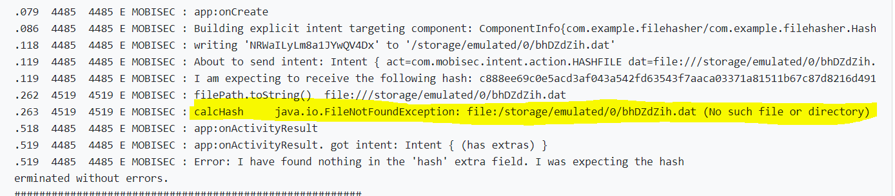
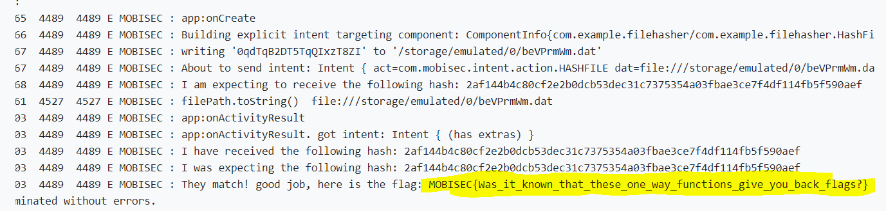

# Solution


## Description of the problem

I will need to write an app that exports a functionality to compute the SHA256 hash of a given file. I will need to define an activity with an intent filter for the "com.mobisec.intent.action.HASHFILE" action. The system will start my activity and ask me for hashing a file. The file path is specified in the Uri part of the intent I receive (which I can access with Intent.getData()). This file will always be stored on the SDCard (so make sure to request the right permissions ;-)). I need to put the calculated hash in a result intent (under the "hash" key, see below) and in hexadecimal format. To help me debug problems, the system will add in the log what the content of the file was, what it was expecting as the result hash, and what it found from my reply. If the expected hash and the one from your app match, the flag will be printed in the logs.

## Solution

Firstly, in the manifest file I give permission to allow the application to read from external storage.

```xml
<uses-permission android:name="android.permission.READ_EXTERNAL_STORAGE"/>
```

Then I set the intent filter

```xml
<activity android:name=".HashFile" android:exported="true">
    <intent-filter>
        <action android:name="com.mobisec.intent.action.HASHFILE" />
    </intent-filter>
</activity>
```

Then, I establish a new class named "HashFile". In this new class, in onCreate function, the hash of the file is calculated and returned in the intent. 

```java
@Override
    protected void onCreate(Bundle savedInstanceState) {
        super.onCreate(savedInstanceState);
       // setContentView(R.layout.activity_main);
        Uri filePath=getIntent().getData();
        Log.e("MOBISEC","filePath.toString()\t"+filePath.toString());
        // calculate hash
        String hash = calcHash(filePath.toString());
        // return the hash in a "result" intent
        Intent resultIntent = new Intent();
        resultIntent.putExtra("hash", hash);
        setResult(Activity.RESULT_OK, resultIntent);
        finish();
    }
```

And in the function "calcHash", the file is read and sha256 hex value is calculated

```java
public String calcHash(String filePath) {
    InputStream inputStream = null;
    try {
        File file = new File(filePath); 
        byte[] buffer = new byte[1024]; // The buffer to read the file
        MessageDigest digest = MessageDigest.getInstance("SHA-256"); // Get a SHA-  instance
        inputStream = new FileInputStream(file);
        int numRead = 0; // Record how many bytes have been read
        while (numRead != -1) {
            numRead = inputStream.read(buffer);
            if (numRead > 0)
                digest.update(buffer, 0, numRead); // Update the digest
        }
        byte[] sha2Bytes = digest.digest(); // Complete the hash computing
        return convertHashToString(sha2Bytes); // Call the function to convert to hex digits
    } catch (Exception e) {
        {
            Log.e("MOBISEC","calcHash\t"+e);
            return null;
        }
    } finally {
        if (inputStream != null) {
            try {
                inputStream.close(); // Close the InputStream
            } catch (Exception e) {
            }
        }
    }
}


private static String convertHashToString(byte[] hashBytes) {
    String returnVal = "";
    for (int i = 0; i < hashBytes.length; i++) {
        returnVal += Integer.toString(( hashBytes[i] & 0xff) + 0x100, 16).substring(1);
    }
    return returnVal.toLowerCase();
}
```


Then I try these codes:



From the result, the error log shows that the file cannot be found. I think this error may be due to the missing `/` symbols in the file path when the Uri is transferred to the String. So I think of a tricky method. I try to remove the five chars `file:` from the file path string. Then I have a try:

```java
public String calcHash(String filePath) {
        InputStream inputStream = null;
        try {
            String[] prefix = {
                    "file:"};
            File file = new File(removePrefix(filePath,prefix)); 
           ... ...
}

public static String removePrefix(String str, String[] prefix) {
        if (str.isEmpty()) {
            return "";
        } else {
            if (null != prefix) {

                String[] prefixArray = prefix;

                for(int i = 0; i < prefix.length; ++i) {

                    String pf = prefixArray[i];
                    if (str.toLowerCase().matches("^" + pf.toLowerCase() + ".*")) {

                        return str.substring(pf.length());
                    }
                }
            }
            return str;
        }
}
```

Finally, with this tricky method, I get the flag




## Optional Feedback

It would be better if some reference links about the file read functions and hash functions can be provided.

## reference

READ_EXTERNAL_STORAGE: https://developer.android.com/reference/android/Manifest.permission#READ_EXTERNAL_STORAGE

remove/remove string specified prefix code: https://www.cxyzjd.com/article/qq_21187515/91906912

hash function code: https://blog.csdn.net/twlkyao/article/details/16993109

hash function code: https://www.jianshu.com/p/d471bb6a9187