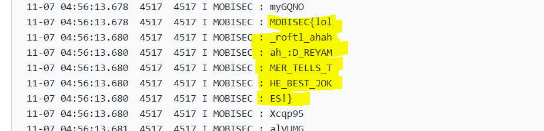

# Solution


## Description of the problem

query contents provided by the target app 

## Solution

Firstly, in the manifest file I give content provider permissions to allow my app to retrieve data. 

```xml
<uses-permission android:name="android.permission.READ_USER_DICTIONARY" />
```


Then, I constructing the query. Some variables for accessing the User Dictionary Provider are defined, such as Uri and projection. Then use `ContentResolver.query()` to query the given Uri, returning a `Cursor` over the result. To getting data from query results, I retrieve spellings from the user dictionary and then look them up.

```java
public class MainActivity extends AppCompatActivity {

    static final String PROVIDER_NAME = "com.mobisec.provider.Joke";
    static final String URL = "content://" + PROVIDER_NAME + "/jokes";

    @Override
    protected void onCreate(Bundle savedInstanceState) {
        super.onCreate(savedInstanceState);
        setContentView(R.layout.activity_main);

        // Queries the user dictionary and returns results
        // Does a query against the table and returns a Cursor object
        Cursor cursor = getContentResolver().query(
                Uri.parse(URL),   // The content URI of the words table
                new String[]{"author", "joke"},                        // The columns to return for each row
                null,                   // Selection criteria
                null,                     // Selection criteria
                null);                        // The sort order for the returned rows

        // Some providers return null if an error occurs, others throw an exception
        if (null == cursor) {
            /*
             * Insert code here to handle the error. Be sure not to use the cursor! You may want to
             * call android.util.Log.e() to log this error.
             *
             */
            android.util.Log.i("MOBISEC","null == cursor");
        // If the Cursor is empty, the provider found no matches
        } else if (cursor.getCount() < 1) {
            /*
             * Insert code here to notify the user that the search was unsuccessful. This isn't necessarily
             * an error. You may want to offer the user the option to insert a new row, or re-type the
             * search term.
             */
            android.util.Log.i("MOBISEC","cursor.getCount() < 1");
        } else {
            // Insert code here to do something with the results
            while (cursor.moveToNext()) {
                // Gets the value from the column.
                String newWord = cursor.getString(cursor.getColumnIndex(PROVIDER_NAME));

                // Insert code here to process the retrieved word.
                Log.i("MOBISEC",newWord);

                // end of while loop
            }
        }
    }
}
```


Then I get the flag




## Optional Feedback


## reference

Content provider basics: https://developer.android.com/guide/topics/providers/content-provider-basics#Basics

Android database operation-Cursor: https://www.jianshu.com/p/b290eecbd87e