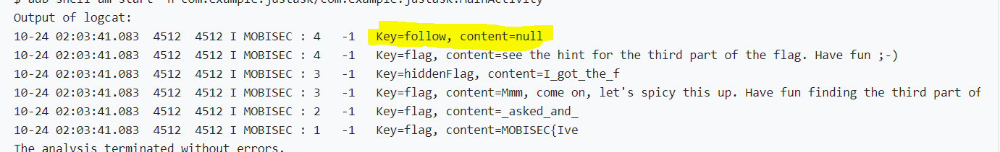
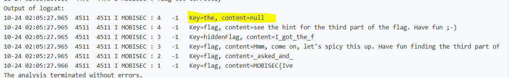
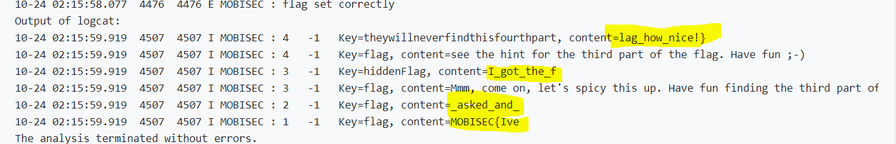

# Solution


## Description of the problem

There is an app installed on the system. The app has four activities. Each of them has one part of the flag. If I ask them nicely, they will all kindly reply with their part of the flag. They will reply with an Intent, the part of the flag is somehow contained there. Check the app's manifest for the specs. Good luck ;-)

## Solution

Firstly, according to the manifest file provided by the app, I need to send intent, with the package name `com.mobisec.justask` , class name `com.mobisec.justask.PartX`. For part two and part four, I need to set the action `com.mobisec.intent.action.JUSTASK` and `com.mobisec.intent.action.JUSTASKBUTNOTSOSIMPLE`. Then, I get the response.

```java
Intent sendIntent1 = new Intent();
sendIntent1.setClassName("com.mobisec.justask","com.mobisec.justask.PartOne");
startActivityForResult(sendIntent1,1);


Intent sendIntent2 = new Intent("com.mobisec.intent.action.JUSTASK");
sendIntent2.setClassName("com.mobisec.justask","com.mobisec.justask.PartTwo");
startActivityForResult(sendIntent2,2);

Intent sendIntent3 = new Intent();
sendIntent3.setClassName("com.mobisec.justask","com.mobisec.justask.PartThree");
startActivityForResult(sendIntent3,3);

Intent sendIntent4 = new Intent("com.mobisec.intent.action.JUSTASKBUTNOTSOSIMPLE");
sendIntent4.setClassName("com.mobisec.justask","com.mobisec.justask.PartFour");
startActivityForResult(sendIntent4,4);
```

```java
@Override
protected void onActivityResult(int requestCode, int resultCode, Intent data)
{
    Bundle bundle =data.getExtras();
    Log.i("MOBISEC", requestCode + "   " + resultCode + "   Key=" + key + ", content=" + bundle.getString(key));  
}
```

However, I get the response like this:




One of the value in the bundle is null. I am thinking that maybe there is a bundle nesting in the value of the key "follow". Then I try to unbundle this null value as another bundle.

```java
for (String key: bundle.keySet() ) {
     if(bundle.getString(key)!=null){//if(!key.equals("follow")) {
         Log.i("MOBISEC", requestCode + "   " + resultCode + "   Key=" + key + ", content=" + bundle.getString(key));
     }
     else
     {
         Bundle bundle1 = (Bundle)bundle.get(key);
         for (String key1: bundle1.keySet() )
         {
             Log.i("MOBISEC", requestCode + "   " + resultCode + "   Key=" + key1 + ", content=" + bundle1.getString(key));
         }
     }
```

Then I get this. There is still a null value with the key "the".



Then I am thinking maybe the real value is nested in the bundle that is nested in the first outer bundle that is nested in the second outer bundle..........  So I try to use recursion to unbundle it.

```java
@Override
protected void onActivityResult(int requestCode, int resultCode, Intent data)
{
    Bundle bundle =data.getExtras();
    unzipBundle( bundle,  requestCode,  resultCode);
}

protected void unzipBundle(Bundle bundle, int requestCode, int resultCode)
{
    for(String k:bundle.keySet())
    {
        Object v=bundle.get(k);
        if(v.getClass().getSimpleName().equals("String"))
        {
            Log.i("MOBISEC", requestCode + "   " + resultCode + "   Key=" + k + ", content=" + bundle.getString(k));
        }
        else {
            unzipBundle((Bundle) v,requestCode,resultCode);
        }
    }
}
```

Then I get the flag:




## Optional Feedback

It would be better if some reference links about the API or functions that can be or should be used to solve the challenge can be provided.

## reference

Intent and intent filter: https://developer.android.com/guide/components/intents-filters#Resolution

Context: https://developer.android.com/reference/android/content/Context#startActivity(android.content.Intent)

instanceof and simpleName : https://www.cnblogs.com/dashuai01/p/4772757.html

Bundle: https://developer.android.com/reference/android/os/Bundle

startActivityForResult : https://www.cnblogs.com/linjiqin/archive/2011/06/03/2071956.html

send intent: https://developer.android.com/training/sharing/send?hl=zh-cn

intent manifest: https://www.codenong.com/cs105847892/ , https://blog.csdn.net/bfboys/article/details/52589817 , https://www.cnblogs.com/skywang12345/archive/2013/03/10/3165552.html


