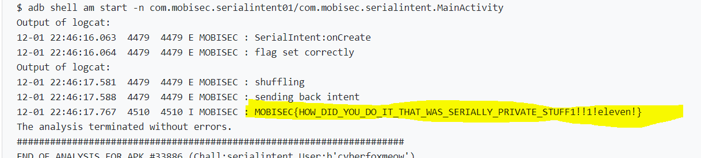

# Solution

## Description of the problem

## Solution

Finally, with this tricky method, I get the flag

## Optional Feedback

## reference

https://developer.android.com/reference/java/io/Serializable

https://developer.android.com/reference/android/content/Intent

https://developer.android.com/guide/components/intents-filters

https://pretagteam.com/question/passing-data-through-intent-using-serializable

https://developer.android.com/reference/android/os/Bundle#putSerializable(java.lang.String,%20java.io.Serializable)

https://www.runoob.com/w3cnote/android-tutorial-intent-pass-data.html

https://developer.android.com/training/sharing/receive?hl=zh-cn#receiving-data-activity

https://developer.android.com/training/basics/intents/result#register

https://blog.csdn.net/liuhenghui5201/article/details/41683593

https://juejin.cn/post/6844903520815022093#heading-1

https://zhuanlan.zhihu.com/p/136083521

http://gityuan.com/2017/03/19/android-classloader/