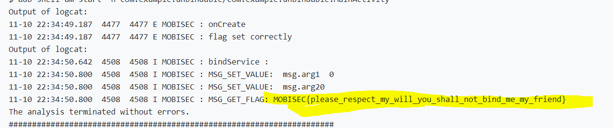

# Solution


## Description of the problem

bind a service from the client to the remote processes, and retrieve the response. 

## Solution

From the manifest file and java codes provided, the remote process is using Messenger to send flag to another client if the user-defined message code is 4.

To use Messenger to communicate with remote processes, I follow the [android develop guide](https://developer.android.com/guide/components/bound-services#Messenger) to set a class "MessengerService". In the codes, I implements a `Handler` that receives a callback for each call , and the service uses the `Handler` to create a `Messenger` object which is a reference to the `Handler`. The `Messenger` creates an `IBinder` that the service returns to clients from `onBind()`. Clients use the `IBinder` to instantiate the `Messenger` (that references the service's `Handler`), which the client uses to send `Message` objects to the service. The service receives each `Message` in its `Handler`—specifically, in the `handleMessage()` method.

```java
public class MessengerService extends Service {
    /**
     * Command to the service to display a message
     */
    static final int MSG_REGISTER_CLIENT = 1;
    static final int MSG_UNREGISTER_CLIENT = 2;
    static final int MSG_SET_VALUE = 3;
    static final int MSG_GET_FLAG = 4;

    /**
     * Handler of incoming messages from clients.
     */
    static class IncomingHandler extends Handler {
        /*private Context applicationContext;

        IncomingHandler(Context context) {
            applicationContext = context.getApplicationContext();
        }*/

        @Override
        public void handleMessage(Message msg) {
            switch (msg.what) {
//                case MSG_SAY_HELLO:
//                    Toast.makeText(applicationContext, "hello!", Toast.LENGTH_SHORT).show();
//                    break;
                case MSG_REGISTER_CLIENT:
                    break;
                case MSG_UNREGISTER_CLIENT:
                    break;
                case MSG_SET_VALUE:
                    Log.i("MOBISEC", "MSG_SET_VALUE:  msg.arg1   " + msg.arg1 );
                    Log.i("MOBISEC", "MSG_SET_VALUE:  msg.arg2   " + msg.arg2);
                    break;
                case MSG_GET_FLAG:
                    Bundle b = (Bundle) msg.obj;
                    //String info = (String) ((Bundle) msg.obj).get("flag");
                    String info = (String) b.get("flag");
                    Log.i("MOBISEC", "MSG_GET_FLAG: "+info);
                    break;
                default:
                    super.handleMessage(msg);
            }
        }
    }

    /**
     * Target we publish for clients to send messages to IncomingHandler.
     */
    //static Messenger mMessenger;
    static Messenger mMessenger = new Messenger(new IncomingHandler( ));

    /**
     * When binding to the service, we return an interface to our messenger
     * for sending messages to the service.
     */
    @Override
    public IBinder onBind(Intent intent) {
        //Toast.makeText(getApplicationContext(), "binding", Toast.LENGTH_SHORT).show();
        Log.i("MOBISEC","binding");
        //mMessenger = new Messenger(new IncomingHandler( ));
        return mMessenger.getBinder();
    }
}
```


What the client needs to do is create a `Messenger` based on the `IBinder` returned by the service and send a message using `send()`.

To bind to the service, the client should call `bindService()`. The Android system then calls the service's `onBind()` method, which returns an `IBinder` for interacting with the service. To receive the `IBinder`, the client must create an instance of `ServiceConnection` and pass it to `bindService()`. The `ServiceConnection` includes a callback method that the system calls to deliver the `IBinder`.

```java
public class MainActivity extends AppCompatActivity {

    /** Messenger for communicating with the service. */
    Messenger mService = null;

    /** Flag indicating whether we have called bind on the service. */
    boolean bound;

    private ServiceConnection mConnection = new ServiceConnection() {
        public void onServiceConnected(ComponentName className, IBinder service) {
            // This is called when the connection with the service has been
            // established, giving us the object we can use to
            // interact with the service.  We are communicating with the
            // service using a Messenger, so here we get a client-side
            // representation of that from the raw IBinder object.
            mService = new Messenger(service);
            bound = true;

            sayHello();
        }

        public void onServiceDisconnected(ComponentName className) {
            // This is called when the connection with the service has been
            // unexpectedly disconnected -- that is, its process crashed.
            mService = null;
            bound = false;
        }

        public void sayHello(){
            if (!bound) return;
            // Create and send a message to the service, using a supported 'what' value
            Message msg=Message.obtain(null,MessengerService.MSG_REGISTER_CLIENT);
            msg.replyTo=MessengerService.mMessenger;
            try {
                mService.send(msg);
            } catch (RemoteException e) {
                e.printStackTrace();
                Log.i("MOBISEC", "RemoteException e 1: "+e);
            }

            msg=Message.obtain(null,MessengerService.MSG_SET_VALUE);
            try {
                mService.send(msg);
            } catch (RemoteException e) {
                e.printStackTrace();
                Log.i("MOBISEC", "RemoteException e 2: "+e);
            }

            msg=Message.obtain(null,MessengerService.MSG_GET_FLAG);
            try {
                mService.send(msg);
            } catch (RemoteException e) {
                e.printStackTrace();
                Log.i("MOBISEC", "RemoteException e 3: "+e);
            }
        }

    };


    @Override
    protected void onCreate(Bundle savedInstanceState) {
        super.onCreate(savedInstanceState);
        setContentView(R.layout.activity_main);

        // Bind to the service
        Intent intent = new Intent();
        intent.setClassName("com.mobisec.unbindable","com.mobisec.unbindable.UnbindableService");
        bindService(intent, mConnection, Context.BIND_AUTO_CREATE);
        bound=true;
        Log.i("MOBISEC", "bindService : " );
    }

   /* @Override
    protected void onStart() {
        super.onStart();
        // Bind to the service
        Intent intent = new Intent();
        intent.setClassName("com.mobisec.unbindable","com.mobisec.unbindable.UnbindableService");
        bindService(intent, mConnection, Context.BIND_AUTO_CREATE);
        bound=true;
        Log.i("MOBISEC", "bindService : " );
    }*/


}
```


Then I get the flag




## Optional Feedback


## reference

Android Developers Docs Reference  Message: https://developer.android.com/reference/android/os/Message

Use Messenger for inter-process communication: https://juejin.cn/post/6906688564071923719

Message.obtain(): https://www.jianshu.com/p/8d4f2746a58d

Android inter-process communication Messenger details: https://www.jianshu.com/p/ee2d260eae22

bindService: https://developer.android.com/reference/android/content/Context#bindService(android.content.Intent,%20android.content.ServiceConnection,%20int)

bound services: https://developer.android.com/guide/components/bound-services#Basics

Message of Handler: https://www.jianshu.com/p/a6c01dd2efdc