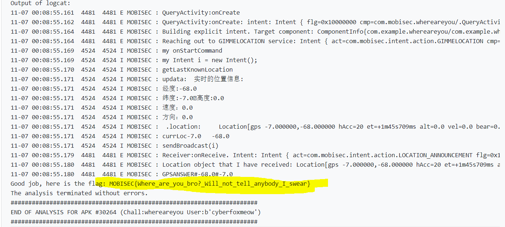

# Solution


## Description of the problem

I need to declare and implement a service with an intent filter with action `com.mobisec.intent.action.GIMMELOCATION`. The system will find my service and it will start it with a `startService()` method (and an appropriate intent as argument). The system expects to get back the current location (as a `Location` object).

During the test, the system will change the current location at run-time and it will query my service to get the updated location. If the expected location matches with what I reply back, the flag will be printed in the logs.

My service should "return" the reply to the system with a broadcast intent, with a specific action and bundle.

## Solution

Firstly, in the manifest file I give permission to allow the application to access approximate location and precise location.

```xml
 <uses-permission android:name="android.permission.ACCESS_COARSE_LOCATION" />
 <uses-permission android:name="android.permission.ACCESS_FINE_LOCATION" />
```

Then I implement a service and set the intent filter

```xml
        <service android:name=".Location0" android:exported="true" android:foregroundServiceType="location">
            <intent-filter>
                <action android:name="com.mobisec.intent.action.GIMMELOCATION" />
            </intent-filter>
        </service>
```

Then, I establish a new class named "Location0". In this new class, in onStartCommand function, the app gets the current location and sends it in the intend. 

To update the location, a LocationManager object is defined. LocationManager is an entry-level class for obtaining location information. To obtain location information, it is firstly needed to obtain a LocationManger object. Location class describes the category of geographic location information, recording latitude and longitude, altitude, time to obtain coordinates, speed, bearing, etc. The location coordinates can be obtained through LocationManager.getLastKnowLocation(provider).

LocationListener is the location listener interface used to monitor location (including GPS, network, base station, etc.) changes, monitor the switch and status of the device. To obtain the location information dynamically in real time, the interface must be implemented first, and the function code is added to the related method. The implementation of the interface can be implemented using internal classes or anonymous implementation and then register to listen: LocationManger.requestLocationUpdates(Stringprovider, long minTime, float minDistance, LocationListener listener). After use, it is needed to remove the listener at the appropriate location: LocationManager.removeUpdates(LocationListener listener). (I ignore this in my codes.) 

LocationListener implementation methods:

- onLocationChanged(Locationlocation): This method will be called automatically when the location changes. The parameter location records the latest location information.
- onStatusChanged(String provider, int status, Bundle extras): This method is automatically called when the status of the location provider changes (available to unavailable, unavailable to available); the parameter provider is the name of the location provider, and status is the status information : OUT_OF_SERVICE, AVAILABLE, TEMPORARILY_UNAVAILABLE, extras are additional data: key/value, such as satellites;
- onProviderEnabled(String provider): Called automatically when the location information provider is available, for example, when the user turns off the GPS, the provider is "gps";
- onProviderDisabled(String provider): Called automatically when location information is not available.

```java
public class Location0 extends Service {
    int startMode;       // indicates how to behave if the service is killed
    IBinder binder;      // interface for clients that bind
    boolean allowRebind; // indicates whether onRebind should be used

    public static LocationManager mLocationManager; 

    public static Location location;

    @Override
    public void onCreate() {
    }

    @Override
    public int onStartCommand(Intent intent, int flags, int startId) {
        // The service is starting, due to a call to startService()
        Intent i = new Intent();
        i.setAction("com.mobisec.intent.action.LOCATION_ANNOUNCEMENT");

        mLocationManager = (LocationManager) getSystemService(Context.LOCATION_SERVICE);
        location = mLocationManager.getLastKnownLocation(LocationManager.GPS_PROVIDER);

        mLocationManager.requestLocationUpdates(LocationManager.GPS_PROVIDER, 1, 1, new LocationListener() {
            @Override
            public void onStatusChanged(String provider, int status, Bundle extras) {
                // TODO Auto-generated method stub
            }

            @Override
            public void onProviderEnabled(String provider) {
                MainActivity.updata(mLocationManager.getLastKnownLocation(provider));
            }

            @Override
            public void onProviderDisabled(String provider) {
                // TODO Auto-generated method stub
            }
            @Override
            public void onLocationChanged(Location location) {
                MainActivity.updata(location);
            }
        });
        MainActivity.updata(location);

        i.putExtra("location", location);
        sendBroadcast(i);

        return startMode;
    }


    @Override
    public IBinder onBind(Intent intent) {
        // A client is binding to the service with bindService()
        return binder;
    }

    @Override
    public boolean onUnbind(Intent intent) {
        // All clients have unbound with unbindService()
        return allowRebind;
    }

    @Override
    public void onRebind(Intent intent) {
        // A client is binding to the service with bindService(),
        // after onUnbind() has already been called
    }

    @Override
    public void onDestroy() {
        // The service is no longer used and is being destroyed
    }
}
```

To get the initial GPS coordinates, I also put the location codes in the MainActivity onCreate. 

Then I get the flag




## Optional Feedback

It would be better if reference links about "requestLocationUpdates" can be provided.

## reference

Request location permissions: https://developer.android.com/training/location/permissions

Get the last known location: https://developer.android.com/training/location/retrieve-current

\<service\>: https://developer.android.com/guide/topics/manifest/service-element

Implementing the lifecycle callbacks: https://developer.android.com/guide/components/services#LifecycleCallbacks 

realtime GPS: https://blog.csdn.net/liuyu973971883/article/details/52550807

https://blog.51cto.com/u_15069471/4187961

https://blog.csdn.net/u012810020/article/details/52517976/?utm_medium=distribute.pc_relevant.none-task-blog-2~default~baidujs_baidulandingword~default-0.no_search_link&spm=1001.2101.3001.4242.1

LocationListener: https://developer.android.com/reference/android/location/LocationListener#summary

LocationManager: https://developer.android.com/reference/android/location/LocationManager

Request location updates: https://developer.android.com/training/location/request-updates