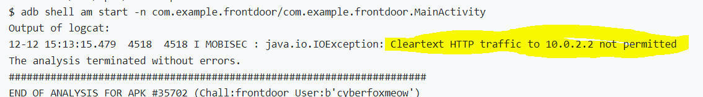

# Solution


## Description of the problem

reverse the apk and find something useful to get the flag

## Solution

Let's see the codes.


In the debug mode, the code gives the username and password, so let's try to send it with GET request to the url. For the reversed code already gives the http connection and request codes, I directly copy these codes.

However, I meet some errors and exceptions.

### java.io.IOException: Cleartext HTTP traffic to 10.0.2.2 not permitted



In order to ensure the security of user data and devices, Google will require the use of encrypted connections by default for the next-generation Android system (Android P) applications, which means that Android P will prohibit apps from using all unencrypted connections. Therefore, Android devices running the Android P system will not be able to transmit in clear code whether they receive or send traffic in the future. They need to use the next-generation (TLS) transport layer security protocol, while Android Nougat and Oreo will not be affected.

The solution is to change network security configuration:

- create an [xml](AndroidStudioProjects_exploitation/frontdoor/app/src/main/res/xml) folder under the [res](AndroidStudioProjects_exploitation/frontdoor/app/src/main/res) folder, and then create a [network_security_config.xml](AndroidStudioProjects_exploitation/frontdoor/app/src/main/res/xml/network_security_config.xml) file, with the content of the file as follows:

  ```xml
  <?xml version="1.0" encoding="utf-8"?>
  <network-security-config>
      <base-config cleartextTrafficPermitted="true" />
  </network-security-config>
  ```

- add the attributes to the <application> tag under the [AndroidManifest.xml](AndroidStudioProjects_exploitation/frontdoor/app/src/main/AndroidManifest.xml) file:

```xml
<application
        ...
        android:networkSecurityConfig="@xml/network_security_config" >
```

- Or, insert directly in the <application> tag of the [AndroidManifest.xml](AndroidStudioProjects_exploitation/frontdoor/app/src/main/AndroidManifest.xml) configuration file

```xml
<application
        ...
        android:usesCleartextTraffic="true" >
```


### java.net.SocketException: socket failed: EACCES (Permission denied)


add permission

```xml
<uses-permission android:name="android.permission.INTERNET" />
```


### android.os.NetworkOnMainThreadException


The official explanation is:

> The exception that is thrown when an application attempts to perform a networking operation on its main thread.
>
> This is only thrown for applications targeting the Honeycomb SDK or higher. Applications targeting earlier SDK versions are allowed to do networking on their main event loop threads, but it's heavily discouraged. See the document [Designing for Responsiveness](https://developer.android.com/guide/practices/design/responsiveness).

Starting from SDK3.0, Google no longer allows network requests (HTTP, Socket) and other related operations to be directly in the main thread.

I find a solution to make the app ignore this exception and send request in the main thread by force, by adding codes:

```java
if (android.os.Build.VERSION.SDK_INT > 9) {
    StrictMode.ThreadPolicy policy = new StrictMode.ThreadPolicy.Builder().permitAll().build();
    StrictMode.setThreadPolicy(policy);
}
```


### flag

Then, finally, I get the flag:


## Optional Feedback


## reference

HttpURLConnection: https://developer.android.com/reference/java/net/HttpURLConnection

Solution to "Cleartext HTTP traffic to xxx not permitted" on Android high version network failure: https://blog.csdn.net/gengkui9897/article/details/82863966

java.net.SocketException: socket failed: EACCES (Permission denied): https://blog.csdn.net/qq_16628781/article/details/51547085

Android exception android.os.NetworkOnMainThreadException: https://blog.csdn.net/a78270528/article/details/47131683

NetworkOnMainThreadException: https://developer.android.com/reference/android/os/NetworkOnMainThreadException