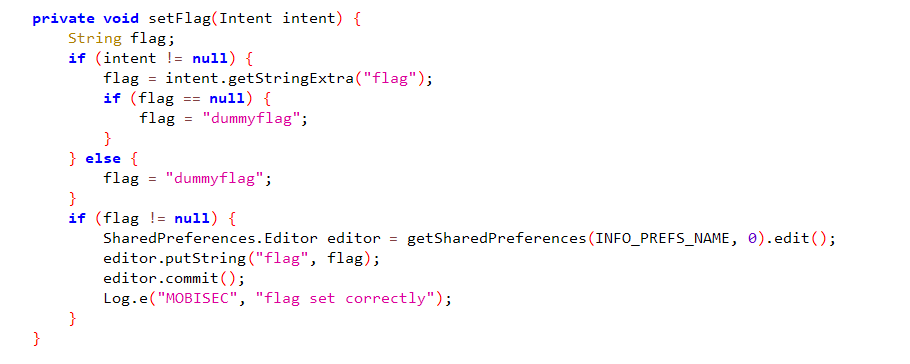
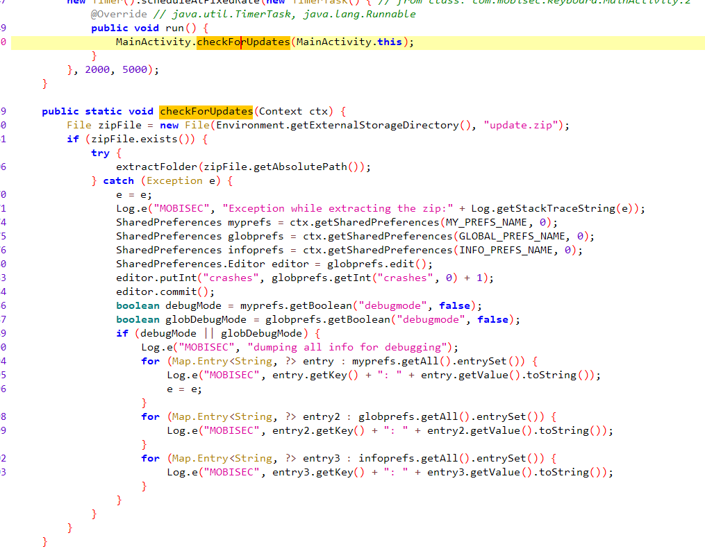
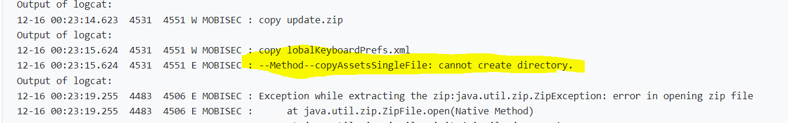
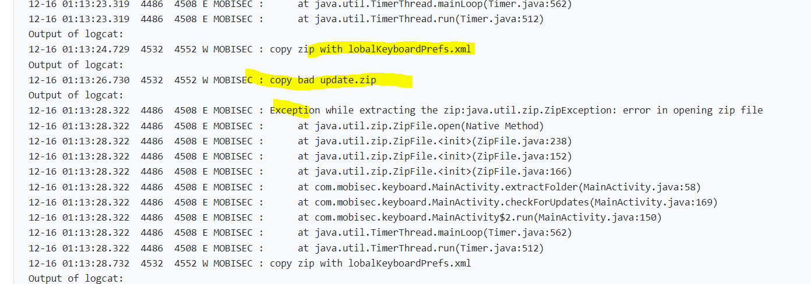
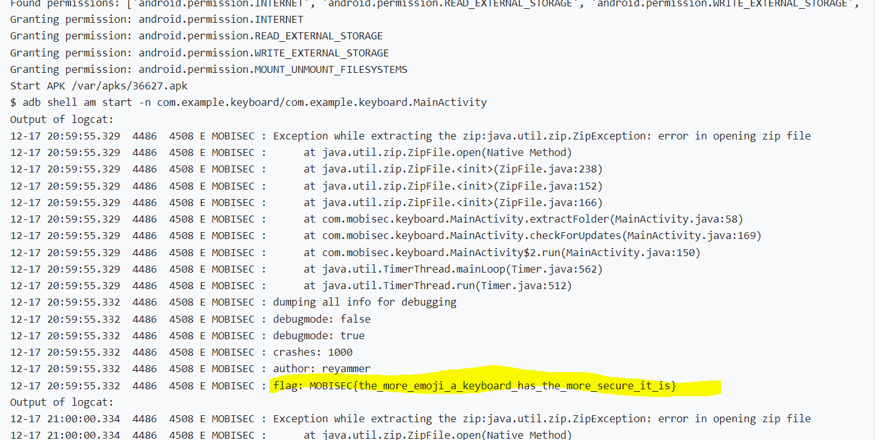

# Solution


## Description of the problem

find something useful to get the flag

## Solution

Let's see the codes.





The flag is set, received from the intent, and stored in the shared preference file `InfoKeyboardPrefs.xml`.

> The software we develop needs to provide users with software parameter setting functions. For the saving of software configuration parameters, if it is a window software, we usually use an ini file to save it, and if it is a j2se application, we will use a properties file or xml to save it. If it is an Android application, what method is most suitable for us to save software configuration parameters? The Android platform provides us with a SharedPreferences class, which is a lightweight storage class, especially suitable for saving software configuration parameters. Use SharedPreferences to save data, behind it is to use xml files to store data, and the files are stored in the /data/data/<package name>/shared_prefs directory


### the first attempt (failed)

Meanwhile, the program is running the function `checkForUpdate()`. This function will extract the `update.zip` to the path `/storage/emulated/0/update.zip`, If there is an exception while extracting, the function will get `debugmode` boolean value from the preference file, and if it is true, the function will print out all the values in the preference file, including the flag. 

Therefore, the steps to get the flag should be:

- overwrite the zip file with a broken zip, so the function will catch an exception;
- copy my own shared preference file `GlobalKeyboardPrefs` to the directory `/data/data/<package name>/shared_prefs` with the boolean value `debugmode` being true, so that the function will print out all the values in the shared preference files.

I put these two files into the assets of the apk file, but this does not work, because of the error: 




### the second attempt (failed)

I guess that maybe the root permission is needed if I want to copy the assets to the directory `/data/...` directly. So, let's try another method:

- overwrite the zip file with a broken zip, so the function will catch an exception;
- copy another zip file with my own shared preference file `GlobalKeyboardPrefs` only with the boolean value `debugmode` being true to the storage, so that the analysis system will unzip my zip file 
- doing these two steps in a infinite loop

However, this attempt still failed. From the console logs, it seems that the function checkForUpdates() of the app get the exception, but does not get shared preference. The reason may be that the app does not read the shared preference file.



I see the codes again, and I find that in the function extractFolder(zipFilePath) the zip file is only extracted to the parent directory, which is `/storage/emulated/0`. However, shared preference file should be extracted to `/data/data/<package name>/shared_prefs`. Therefore, in the zip file, the directory of the shared preference file should be `../../../data/xxx`. Actually we cannot make a file in an zip with the directory of "../" in windows system.


### the third attempt (succeeded)

Now, let's find a method to write the good and bad zip file to the storage directly from the program, not copy them from assets. 

Firstly, the program will output the good zip file with my own shared preference xml file to the external storage. This zip file, with the xml file in the zip entry, is written by the program directly. 

Then, the program will output the bad`update.zip` file to the external storage.

The above two steps are in an infinite while loop.


Finally, I get the flag




The shared preference file is

```xml
<?xml version="1.0" encoding="utf-8"?>
<map>
    <int name="crashes" value="999" />
    <boolean name="debugmode" value="true" />
</map>
```


In manifest file, the following permissions are needed:

```xml
<uses-permission android:name="android.permission.INTERNET"/>
<uses-permission android:name="android.permission.READ_EXTERNAL_STORAGE"/>
<uses-permission android:name="android.permission.WRITE_EXTERNAL_STORAGE"
    tools:ignore="ScopedStorage" />
<uses-permission android:name="android.permission.MOUNT_UNMOUNT_FILESYSTEMS"
    tools:ignore="ProtectedPermissions" />
```

The full codes refer to [here](AndroidStudioProjects_exploitation/keyboard/app/src/main/java/com/example/keyboard/MainActivity.java)


## Optional Feedback

by the way, what is this "true story"?


## reference

SharedPreferences: https://developer.android.com/reference/android/content/SharedPreferences

The file path where SharedPreferences stores variables: https://www.i4k.xyz/article/cc20032706/74668774

Use SharedPreferences for data storage: https://www.cnblogs.com/linjiqin/archive/2011/05/26/2059133.html

Android internal storage/external storage and read and write permissions: https://www.jianshu.com/p/23b203f1b848

Three ways of Android delayed operation: https://blog.csdn.net/qq_33833327/article/details/70946086

ZipEntry class, zip compression and decompression: https://blog.csdn.net/weixin_45109925/article/details/96443201