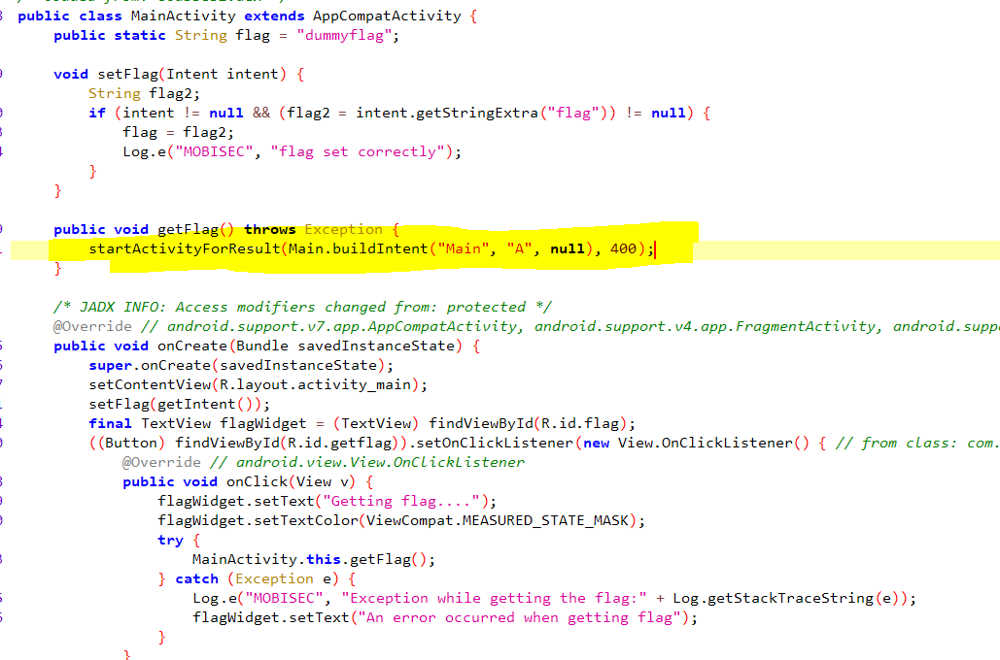
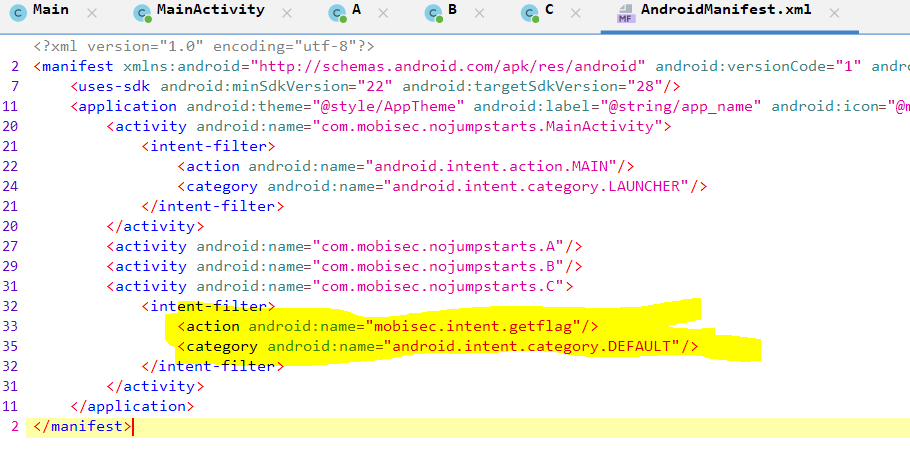
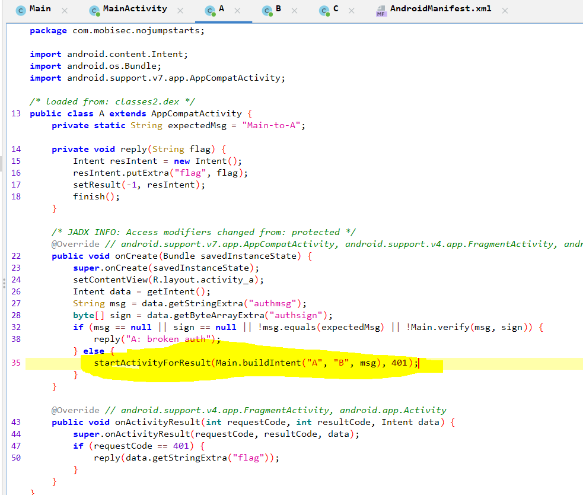
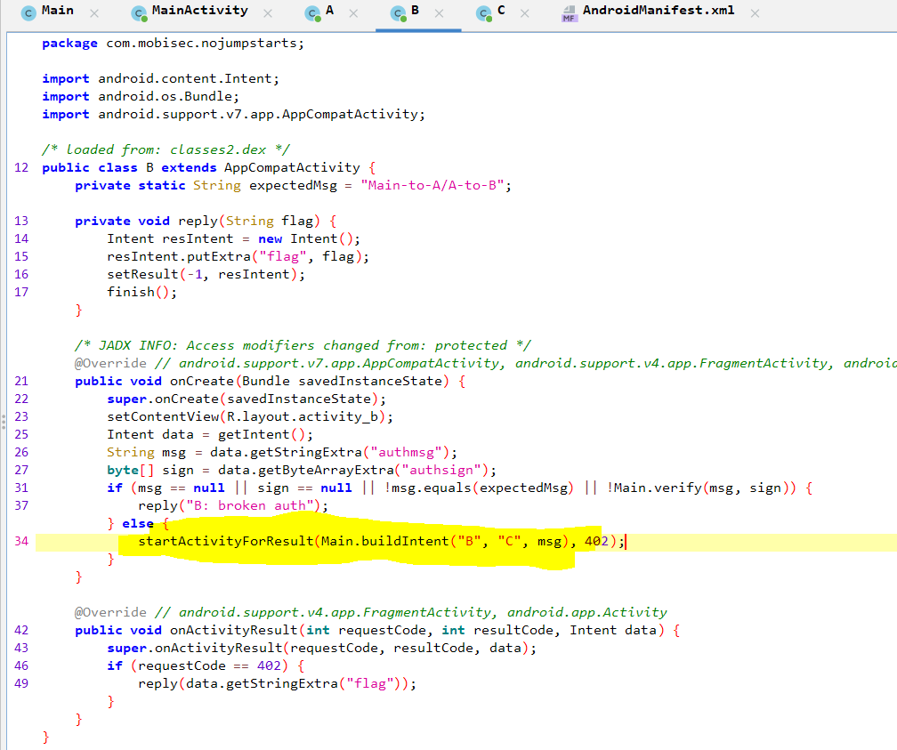
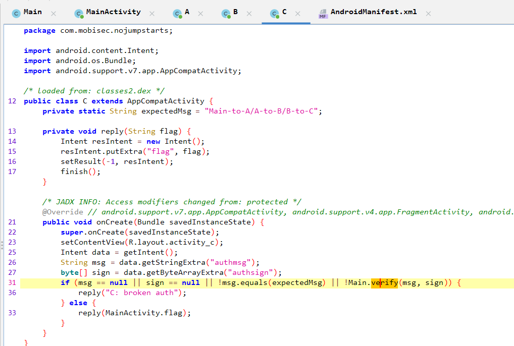
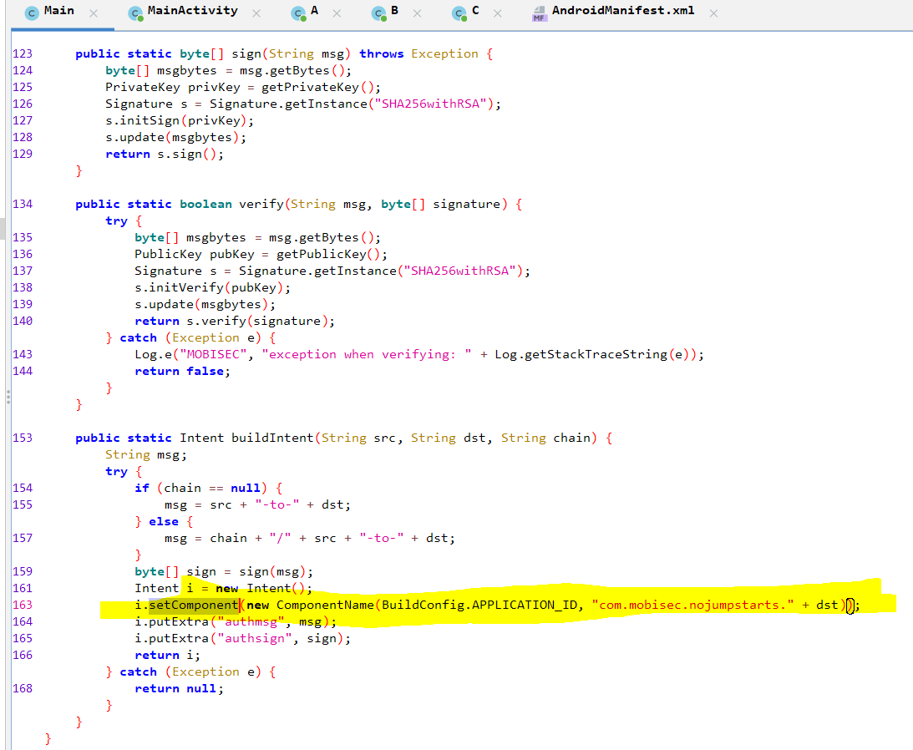
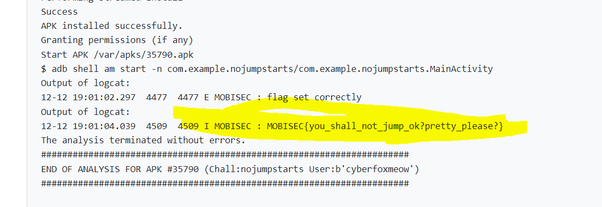

# Solution


## Description of the problem

reverse the apk and find something useful to get the flag

## Solution

Let's see the codes.













In the class `MainActivity`, there is a function `getFlag()` to call function `Main.buildIntent("Main", "A", null)`, where `msg` is "Main-to-A". Then use `i.setComponent` to start another application "com.mobisec.nojumpstarts.A". Then in class `A`, it will call `Main.buildIntent("A", "B", msg)`, where `msg` will be "Main-to-A/A-to-B". Then use `i.setComponent` to start another application "com.mobisec.nojumpstarts.B". Then in class `B`, it will call `Main.buildIntent("B", "C", msg)`, where `msg` will be "Main-to-A/A-to-B/B-to-C". Then use `i.setComponent` to start another application "com.mobisec.nojumpstarts.C". Finally in class `C`, it will reply MainActivity.flag. Also, in manifest xml file, there is only one intent filter for C. So I'm thinking to build the intent with `msg` equals to "Main-to-A/A-to-B/B-to-C" and call class `C` directly.

```java
public class MainActivity extends AppCompatActivity {

    private static String msg = "Main-to-A/A-to-B/B-to-C";

    @Override
    protected void onCreate(Bundle savedInstanceState) {
        super.onCreate(savedInstanceState);
        setContentView(R.layout.activity_main);

        Intent i = new Intent();
        i.setComponent(new ComponentName("com.mobisec.nojumpstarts", "com.mobisec.nojumpstarts.C" ));
        i.putExtra("authmsg", msg);
        try {
            i.putExtra("authsign", Main.sign(msg));
        } catch (Exception e) {
            Log.w("MOBISEC", Log.getStackTraceString(e));
        }
        startActivityForResult(i, 9);
    }

    @Override
    public void onActivityResult(int requestCode, int resultCode, Intent data) {
        super.onActivityResult(requestCode, resultCode, data);
        Log.i("MOBISEC", data.getStringExtra("flag"));
    }
}
```


Then the flag is:




## Optional Feedback


## reference

setComponent: https://developer.android.com/reference/android/content/Intent#setComponent(android.content.ComponentName)

intent.setComponent() method: https://blog.csdn.net/u013598111/article/details/48996839


