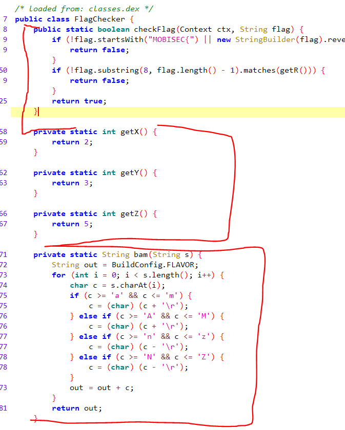
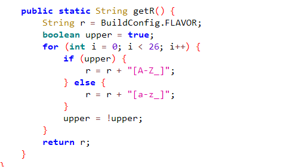
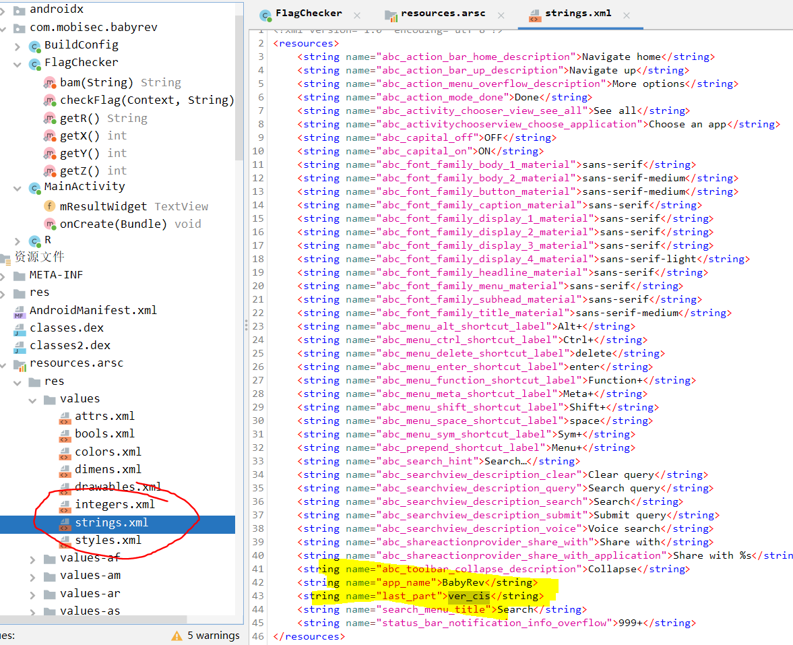

# Solution


## Description of the problem

reverse the .apk to get the source code, and find the flag

## Solution

Firstly, I use jadx to get the source codes of the. apk package

The source codes include FlagChecker class:






Then, I check the first if statement in checkFlag

```java
if (
    !flag.startsWith("MOBISEC{") || 
    new StringBuilder(flag).reverse().toString().charAt(0) != '}' || 
    flag.length() != 35 || 
    !flag.toLowerCase().substring(8).startsWith("this_is_") || 
    !new StringBuilder(flag).reverse().toString().toLowerCase().substring(1).startsWith(ctx.getString(R.string.last_part)) 
    || flag.charAt(17) != '_' 
    || flag.charAt((int) (((double) getY()) * Math.pow((double) getX(), (double) getY()))) != flag.charAt(((int) Math.pow(Math.pow(2.0d, 2.0d), 2.0d)) + 1) 
    || !bam(flag.toUpperCase().substring(getY() * getX() * getY(), (int) (Math.pow((double) getZ(), (double) getX()) - 1.0d))).equals("ERNYYL") 
    || flag.toLowerCase().charAt(16) != 'a' 
    || flag.charAt(16) != flag.charAt(26) 
    || flag.toUpperCase().charAt(25) != flag.toUpperCase().charAt(26) + 1) {
            return false;
}

```


I follow these statements one by one, except the one with an unknown string "last_part", to fill the form.

the bam function is for convert the character by adding or minus 13(0x0D), and functions getX/Y/Z give the value directly.

| flag.length()  != 35                                         | 0    | 1    | 2    | 3    | 4    | 5    | 6    | 7    | 8    | 9    | 10   | 11   | 12   | 13   | 14   | 15   | 16   | 17   | 18   | 19   | 20   | 21   | 22   | 23   | 24   | 25   | 26   | 27   | 28   | 29   | 30   | 31   | 32   | 33   | 34   |
| ------------------------------------------------------------ | ---- | ---- | ---- | ---- | ---- | ---- | ---- | ---- | ---- | ---- | ---- | ---- | ---- | ---- | ---- | ---- | ---- | ---- | ---- | ---- | ---- | ---- | ---- | ---- | ---- | ---- | ---- | ---- | ---- | ---- | ---- | ---- | ---- | ---- | ---- |
| !flag.startsWith("MOBISEC{")                                 | M    | O    | B    | I    | S    | E    | C    | {    |      |      |      |      |      |      |      |      |      |      |      |      |      |      |      |      |      |      |      |      |      |      |      |      |      |      |      |
| new  StringBuilder(flag).reverse().toString().charAt(0) != '}' | M    | O    | B    | I    | S    | E    | C    | {    |      |      |      |      |      |      |      |      |      |      |      |      |      |      |      |      |      |      |      |      |      |      |      |      |      |      | }    |
| !flag.toLowerCase().substring(8).startsWith("this_is_")      | M    | O    | B    | I    | S    | E    | C    | {    | t    | h    | i    | s    | _    | i    | s    | _    |      |      |      |      |      |      |      |      |      |      |      |      |      |      |      |      |      |      | }    |
| flag.charAt(17) != '_'                                       | M    | O    | B    | I    | S    | E    | C    | {    | t    | h    | i    | s    | _    | i    | s    | _    |      | _    |      |      |      |      |      |      |      |      |      |      |      |      |      |      |      |      | }    |
| flag.charAt((int) (((double) getY()) *  Math.pow((double) getX(), (double) getY()))) != flag.charAt(((int)  Math.pow(Math.pow(2.0d, 2.0d), 2.0d)) + 1) | M    | O    | B    | I    | S    | E    | C    | {    | t    | h    | i    | s    | _    | i    | s    | _    |      | _    |      |      |      |      |      |      | _    |      |      |      |      |      |      |      |      |      | }    |
| !bam(flag.toUpperCase().substring(getY()  * getX() * getY(), (int) (Math.pow((double) getZ(), (double) getX()) -  1.0d))).equals("ERNYYL") | M    | O    | B    | I    | S    | E    | C    | {    | t    | h    | i    | s    | _    | i    | s    | _    |      | _    | R    | E    | A    | L    | L    | Y    | _    |      |      |      |      |      |      |      |      |      | }    |
| flag.toLowerCase().charAt(16)  != 'a'                        | M    | O    | B    | I    | S    | E    | C    | {    | t    | h    | i    | s    | _    | i    | s    | _    | a    | _    | R    | E    | A    | L    | L    | Y    | _    |      |      |      |      |      |      |      |      |      | }    |
| flag.charAt(16) !=  flag.charAt(26)                          | M    | O    | B    | I    | S    | E    | C    | {    | t    | h    | i    | s    | _    | i    | s    | _    | a    | _    | R    | E    | A    | L    | L    | Y    | _    |      | a    |      |      |      |      |      |      |      | }    |
| flag.toUpperCase().charAt(25)  != flag.toUpperCase().charAt(26) + 1) | M    | O    | B    | I    | S    | E    | C    | {    | t    | h    | i    | s    | _    | i    | s    | _    | a    | _    | R    | E    | A    | L    | L    | Y    | _    | B    | a    |      |      |      |      |      |      |      | }    |


The above form is not complete, because for now it is unknown what the `last_part` is, and it is unknown about the uppercase or lowercase of each character.


Then, I try to find what the last_part is.




The last_part string is "ver_cis", so I reverse it and fill it into the form.

| 0    | 1    | 2    | 3    | 4    | 5    | 6    | 7    | 8    | 9    | 10   | 11   | 12   | 13   | 14   | 15   | 16   | 17   | 18   | 19   | 20   | 21   | 22   | 23   | 24   | 25   | 26   | 27   | 28   | 29   | 30   | 31   | 32   | 33   | 34   |
| ---- | ---- | ---- | ---- | ---- | ---- | ---- | ---- | ---- | ---- | ---- | ---- | ---- | ---- | ---- | ---- | ---- | ---- | ---- | ---- | ---- | ---- | ---- | ---- | ---- | ---- | ---- | ---- | ---- | ---- | ---- | ---- | ---- | ---- | ---- |
| M    | O    | B    | I    | S    | E    | C    | {    | t    | h    | i    | s    | _    | i    | s    | _    | a    | _    | R    | E    | A    | L    | L    | Y    | _    | B    | a    | s    | i    | c    | _    | r    | e    | v    | }    |


Then from the second if statement in function checkFlag, and from the function getR(), it uses regex to check if the string is UPPER+lower+UPPER+lower...... So, the flag should be:

| 0    | 1    | 2    | 3    | 4    | 5    | 6    | 7    | 8    | 9    | 10   | 11   | 12   | 13   | 14   | 15   | 16   | 17   | 18   | 19   | 20   | 21   | 22   | 23   | 24   | 25   | 26   | 27   | 28   | 29   | 30   | 31   | 32   | 33   | 34   |
| ---- | ---- | ---- | ---- | ---- | ---- | ---- | ---- | ---- | ---- | ---- | ---- | ---- | ---- | ---- | ---- | ---- | ---- | ---- | ---- | ---- | ---- | ---- | ---- | ---- | ---- | ---- | ---- | ---- | ---- | ---- | ---- | ---- | ---- | ---- |
| M    | O    | B    | I    | S    | E    | C    | {    | T    | h    | I    | s    | _    | i    | S    | _    | A    | _    | R    | e    | A    | l    | L    | y    | _    | b    | A    | s    | I    | c    | _    | r    | E    | v    | }    |


The full steps can be referred to [misc/_reversing/babyrev/steps.xlsx](misc/_reversing/babyrev/steps.xlsx)


## Optional Feedback

It is better to mention what the regex is in the challenge, because I am not familiar with this before.


## reference

jadx: https://github.com/skylot/jadx

java regex: https://www.w3cschool.cn/regexp/x9hf1pq9.html

