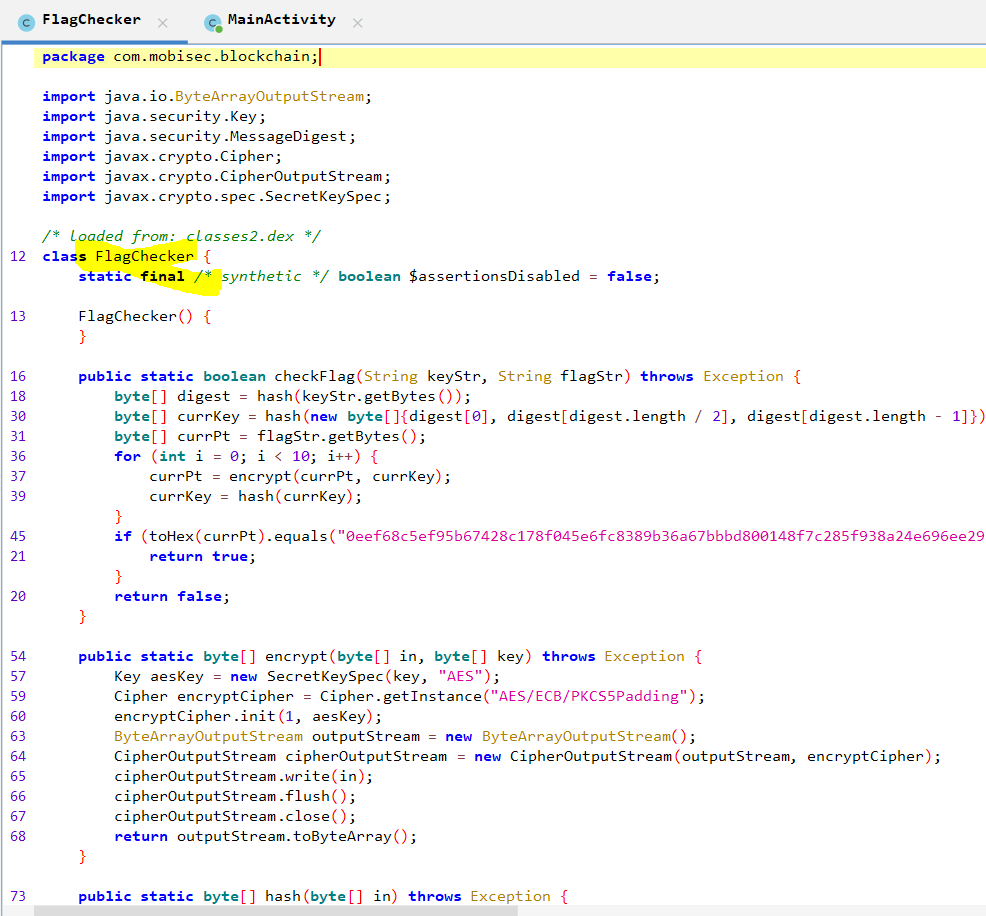
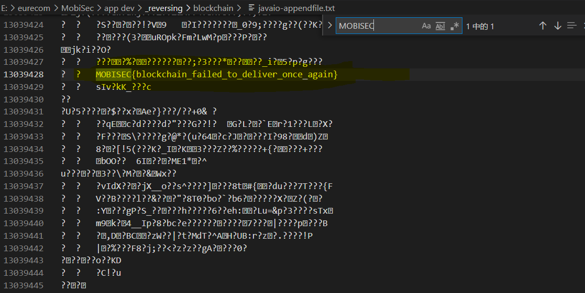

# Solution


## Description of the problem

This app asks for a KEY and a FLAG. You need to find a combination of KEY and FLAG such that the app shows "Valid Flag". Once you find a valid FLAG (no matter what the KEY is), submit it to the system to get points.

## Solution

Let's see the codes.




to check the flag, the initial key is the hash of the string with three characters(digest[0],[len/2],[end]), and ten times of AES encryption are done to get the `currPt`. Then the hex of `currPt `is checked. In this way, for there are only three characters in the initial key, and the hash function (MD5) is only applied on the key, we can try the initial key one by one to generate ten hashes as ten `currKey` in the for loop and decrypt the final result using ten `currKey` to get the flag.

```java
public class FlagFinder {
	
	FlagFinder() {
    }	
	
	public static boolean crackFlag(byte[] key) throws Exception {
       // byte[] digest = hash(keyStr.getBytes());
        byte[] currPt =hexToByteArray("0eef68c5ef95b67428c178f045e6fc8389b36a67bbbd800148f7c285f938a24e696ee2925e12ecf7c11f35a345a2a142639fe87ab2dd7530b29db87ca71ffda2af558131d7da615b6966fb0360d5823b79c26608772580bf14558e6b7500183ed7dfd41dbb5686ea92111667fd1eff9cec8dc29f0cfe01e092607da9f7c2602f5463a361ce5c83922cb6c3f5b872dcc088eb85df80503c92232bf03feed304d669ddd5ed1992a26674ecf2513ab25c20f95a5db49fdf6167fda3465a74e0418b2ea99eb2673d4c7e1ff7c4921c4e2d7b");
        
        byte[][] keys = new byte[11][];
        keys[0]=key;
        for(int i=1;i<=10;i++) {
        	keys[i]=hash(keys[i-1]);
        }
        
        for (int i = 10; i >= 1; i--) {
            currPt = decrypt(currPt, keys[i]);
        }
        
        String currPtString = new String(currPt, StandardCharsets.UTF_8);
        String keyString = new String(key, StandardCharsets.UTF_8);
        
        File file =new File("javaio-appendfile.txt");
        FileWriter fileWritter = new FileWriter(file.getName(),true);
        BufferedWriter bufferWritter = new BufferedWriter(fileWritter);
        bufferWritter.write(keyString+"   "+currPtString+"\n");
        bufferWritter.close();
        
        return true;
    }		
}
```

The full codes refer to  [_reversing/blockchain/src/blockchain_reverse](_reversing/blockchain/src/blockchain_reverse)


Finally, after output all the reversing results, I search the string start with "MOBISEC", then I get the flag. 




## Optional Feedback


## reference

java AES enc/descrypt: https://segmentfault.com/a/1190000021123494 

hex to bytes: https://blog.csdn.net/qq_34763699/article/details/78650272