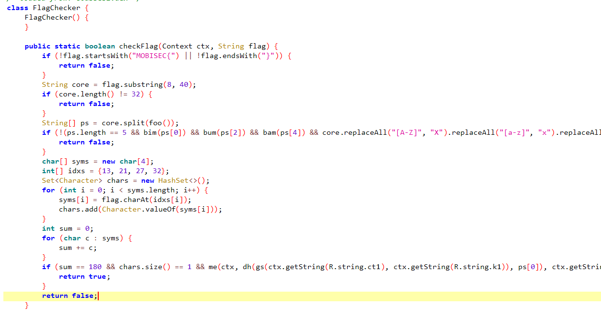
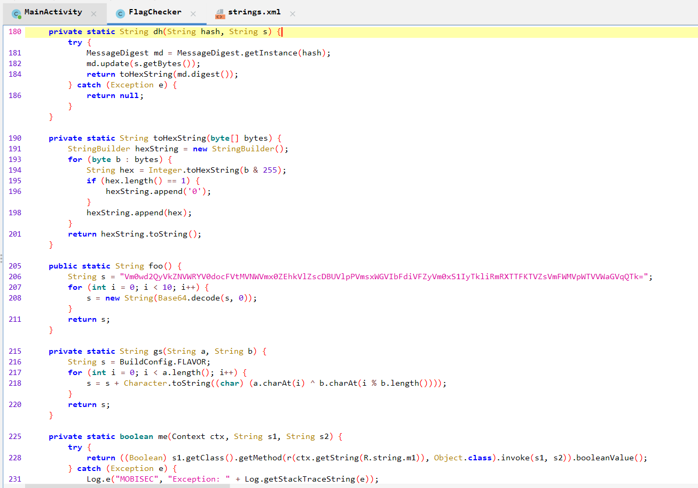
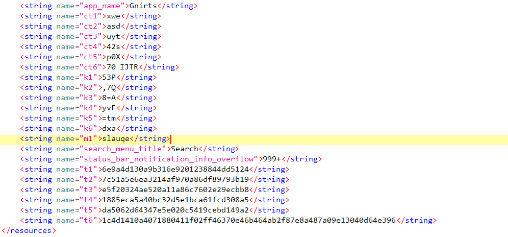
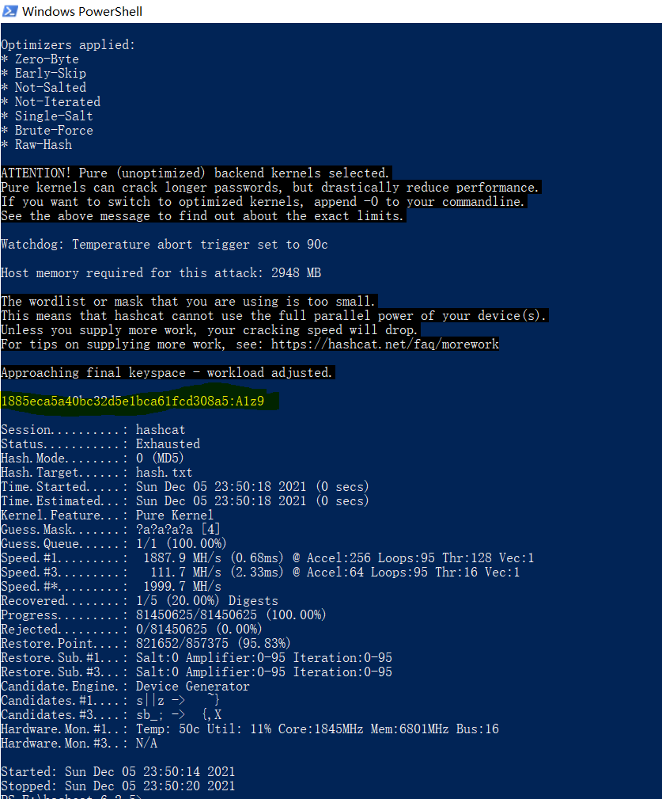
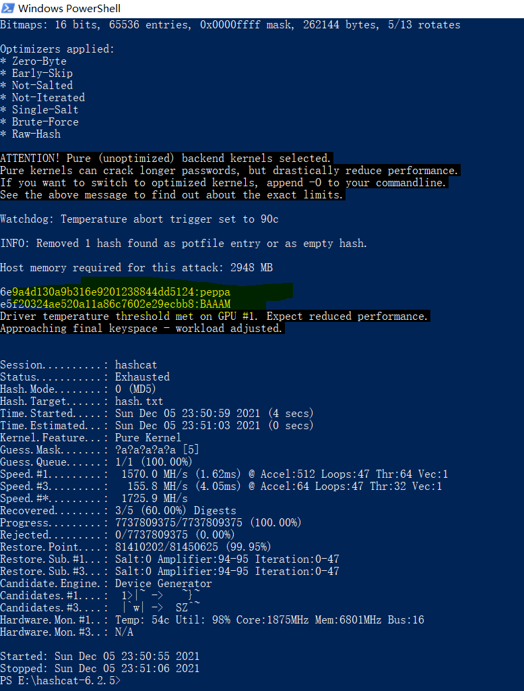
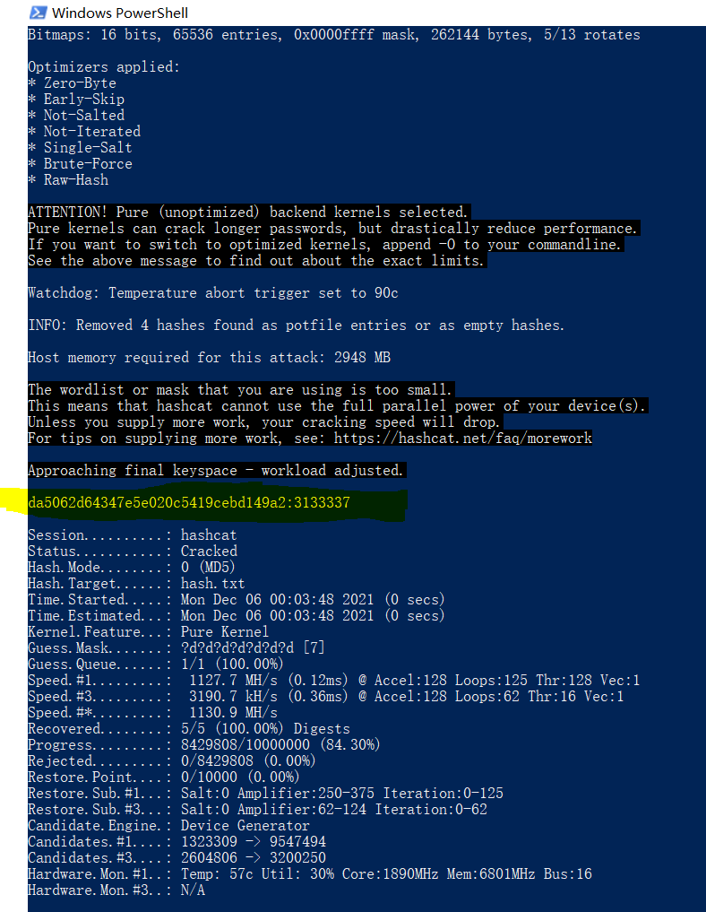
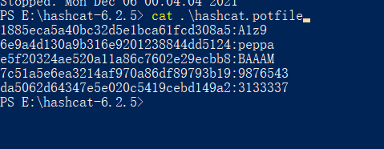
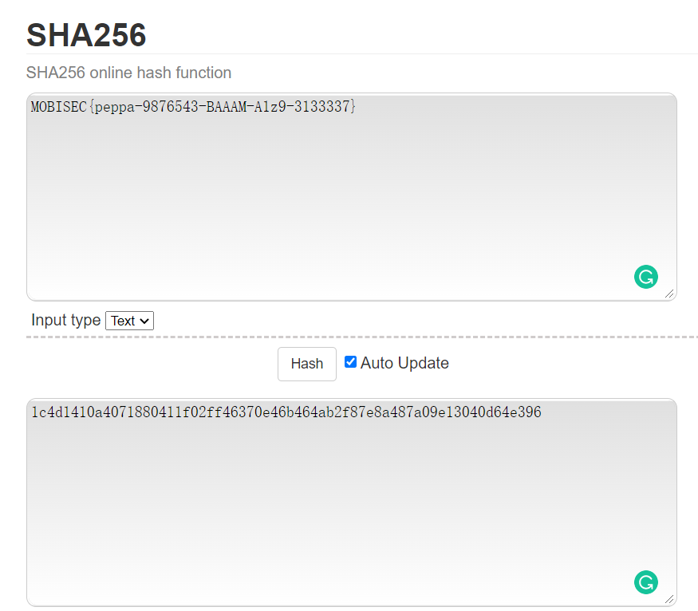

# Solution


## Description of the problem

reverse the .apk to source codes, and find something useful to get the flag

## Solution

Let's see the codes.





From the function checkFlag(flag), we can get the flag information that:

- the flag starts with "MOBISEC{" and ends with "}";
- the length of flag core is 32;

```java
String[] ps = core.split(foo());
if (!(
    ps.length == 5 && 
    bim(ps[0]) && 
    bum(ps[2]) && 
    bam(ps[4]) && 
    core.replaceAll("[A-Z]", "X").replaceAll("[a-z]", "x").replaceAll("[0-9]", " ").matches("[A-Za-z0-9]+.       .[A-Za-z0-9]+.[Xx ]+.[A-Za-z0-9 ]+"))) {
            return false;
}
```

```java
    private static boolean bim(String s) {
        return s.matches("^[a-z]+$");
    }

    private static boolean bum(String s) {
        return s.matches("^[A-Z]+$");
    }

    private static boolean bam(String s) {
        return s.matches("^[0-9]+$");
    }

```

From the above codes, we can get that:

- the flag can be split into 5 parts, by the symbol "foo()";
- ps[0] is lowercases string, ps[2] is uppercases string, and ps[4] is number string;
- the flag should be : [upper+lower]+[numbers only]+[upper+lower]+[upper+lower+number]+[upper+lower+number], not strictly included.

So what the foo() function is?

```java
    public static String foo() {
        String s = "Vm0wd2QyVkZNVWRYV0docFVtMVNWVmx0ZEhkVlZscDBUVlpPVmsxWGVIbFdiVFZyVm0xS1IyTkliRmRXTTFKTVZsVmFWMVpWTVVWaGVqQTk=";
        for (int i = 0; i < 10; i++) {
            s = new String(Base64.decode(s, 0));
        }
        return s;
    }
```

The foo() function decodes the long string s for 10 times. I use an online decode tool (https://www.base64decode.org/ ) to decode it manually. and find that the split char is `-`. 

> Vm0wd2VFMUdXWGhpUm1SVVltdHdVVlp0TVZOVk1XeHlWbTVrVm1KR2NIbFdWM1JMVlVaV1ZVMUVhejA9
>
> Vm0weE1GWXhiRmRUYmtwUVZtMVNVMWxyVm5kVmJGcHlWV3RLVUZWVU1Eaz0=
>
> Vm0xMFYxbFdTbkpQVm1SU1lrVndVbFpyVWtKUFVUMDk=
>
> Vm10V1lWSnJPVmRSYkVwUlZrUkJPUT09
>
> VmtWYVJrOVdRbEpRVkRBOQ==
>
> VkVaRk9WQlJQVDA9
>
> VEZFOVBRPT0=
>
> TFE9PQ==
>
> LQ==
>
> \-


Next, 

```java
        char[] syms = new char[4];
        int[] idxs = {13, 21, 27, 32};
        Set<Character> chars = new HashSet<>();
        for (int i = 0; i < syms.length; i++) {
            syms[i] = flag.charAt(idxs[i]);
            chars.add(Character.valueOf(syms[i]));
        }
        int sum = 0;
        for (char c : syms) {
            sum += c;
        }
		if (sum == 180 && 
            chars.size() == 1 && 
            me(ctx, dh(
                gs(
                    ctx.getString(R.string.ct1), ctx.getString(R.string.k1)), 
                ps[0]
            ), ctx.getString(R.string.t1)    ) && 
            
            me(ctx, dh(gs(ctx.getString(R.string.ct2), ctx.getString(R.string.k2)), ps[1]), ctx.getString(R.string.t2)) && 
            me(ctx, dh(gs(ctx.getString(R.string.ct3), ctx.getString(R.string.k3)), ps[2]), ctx.getString(R.string.t3)) && 
            me(ctx, dh(gs(ctx.getString(R.string.ct4), ctx.getString(R.string.k4)), ps[3]), ctx.getString(R.string.t4)) && 
            me(ctx, dh(gs(ctx.getString(R.string.ct5), ctx.getString(R.string.k5)), ps[4]), ctx.getString(R.string.t5)) && 
            
            me(ctx, dh(
                gs(
                    ctx.getString(R.string.ct6), ctx.getString(R.string.k6)
                ), 
                flag
            ), ctx.getString(R.string.t6)    )) {
            return true;
        }
```

From the above codes, we know that:

the sum of the value of 13th, 21st, 27th, 32th character in flag is 180, and the chars at these four positions are the same char, so the character in these positions should be ascii=45, which is the split character `-`, so the flag should be MOBISEC{xxxxx-0000000-XXXXX-????-0000000};

Then, let us see the function me(s1, s2). It uses ".getMethod(r(ctx.getString(R.string.m1))...)". the function r(s) will return the reverse of the string, and r(string.m1) is equals. So the funttion me(s1,s2) will compare if s1 and s2 are equal or not, I guess. 

Then, the function dh(hash, s) is returning the hex string of the hash (md5) value. 

Actually, I have no idea what the function gs() is doing. But anyway, this is not important, because I know I need to crack some md5 hash values now to get the flag. t1 to t5 are hashes of the parts of the flag, and t6 should be the hash of the whole flag, and t6 should be the hash in sha2 or similar, not md5.




Then, I am using hashcat to crack the hash values.

for t4:  `.\hashcat.exe -a 3 -m 0 hash.txt ?a?a?a?a`




for t1 and t3: `.\hashcat.exe -a 3 -m 0 hash.txt ?a?a?a?a?a`

Actually, I should use `?l?l?l?l?l` and `?u?u?u?u?u`, not `?a`*5, but anyway, I get the result and it does not cost much time.




For t2 and t5: `.\hashcat.exe -a 3 -m 0 hash.txt ?d?d?d?d?d?d?d`

At the beginning I used `?a`*7 by mistake, and get only one result. Then I realized that I should use `?d`, not `?a`.





Then, I get all the plaintexts of the md5 hashes.



The hashes refer to [_reversing/gnirts/hashcat.potfile](_reversing/gnirts/hashcat.potfile)


Finally, combine these plantexts together with the right order, the flag should be




## Optional Feedback


## reference

how to use hashcat: https://www.freebuf.com/sectool/164507.html

