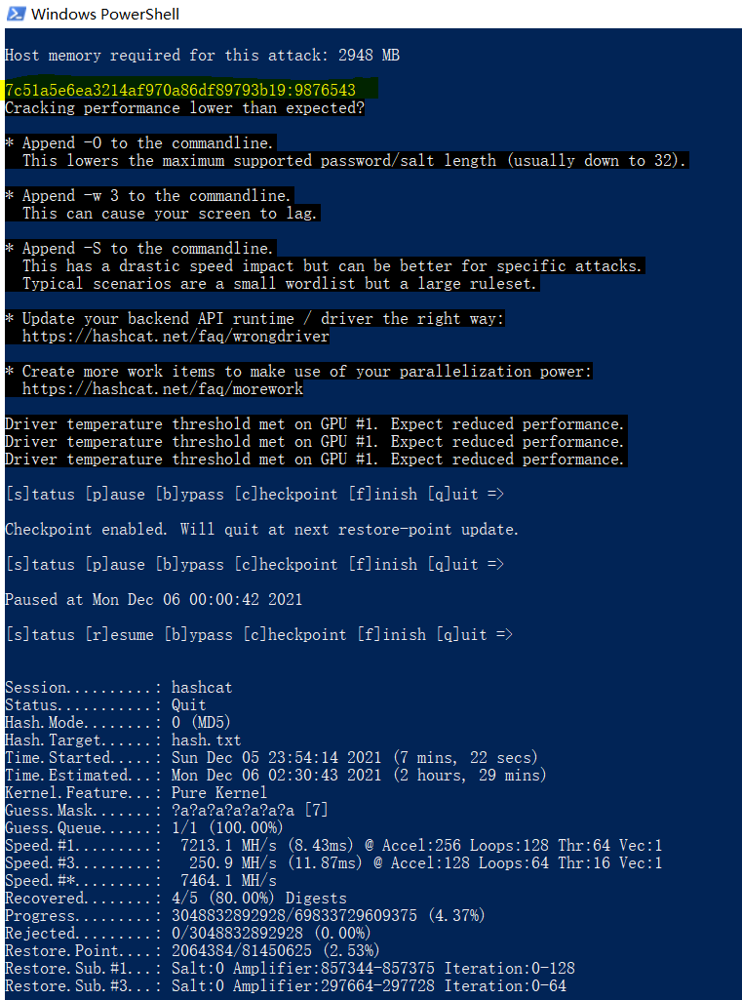

# Solution

## Description of the problem

reverse the .apk to get the pincode

## Solution

 .\hashcat.exe -a 3 -m 0 hash.txt ?a?a?a

The hashes refer to [_reversing/gnirts/hashcat.potfile](_reversing/gnirts/hashcat.potfile)

## Optional Feedback

## reference

how to use hashcat: https://www.freebuf.com/sectool/164507.html

