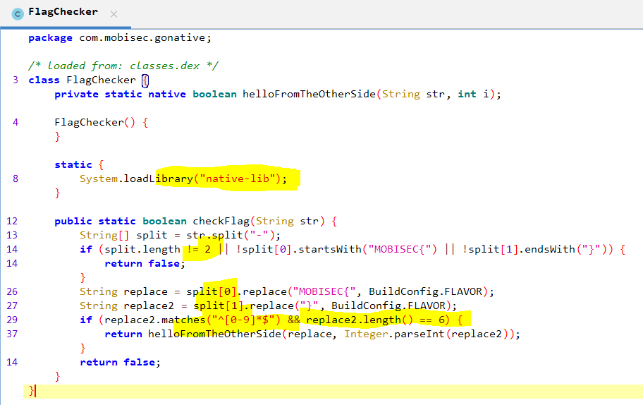
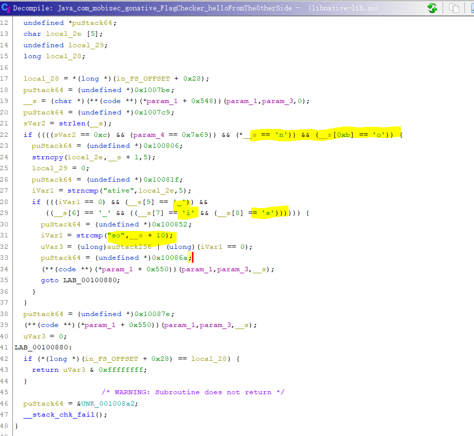

# Solution


## Description of the problem

reverse the .apk to source codes, and find something useful to get the flag

## Solution

Let's see the codes.




From the above codes, we can get that

- the flag contains a string, with the character `-`, and a number of 6 digits.
- the flag checker calls the library "native-lib".

Then, I use [ghidra](https://github.com/NationalSecurityAgency/ghidra) to get the reverse codes of the [libnative-lib.so](_reversing/goingnative/project1/app/src/main/lib/x86_64/libnative-lib.so). 





I copy the codes here, with all the integers in dec.

```c
ulong Java_com_mobisec_gonative_FlagChecker_helloFromTheOtherSide
                (long *param_1,undefined8 param_2,undefined8 param_3,int param_4)

{
  int iVar1;
  char *__s;
  size_t sVar2;
  ulong uVar3;
  long in_FS_OFFSET;
  undefined auStack256 [192];
  undefined *puStack64;
  char local_2e [5];
  undefined local_29;
  long local_28;
  
  local_28 = *(long *)(in_FS_OFFSET + 40);
  puStack64 = (undefined *)1050558;
  __s = (char *)(**(code **)(*param_1 + 1352))(param_1,param_3,0);
  puStack64 = (undefined *)1050569;
  sVar2 = strlen(__s);
  if ((((sVar2 == 12) && (param_4 == 31337)) && (*__s == 'n')) && (__s[11] == 'o')) {
    puStack64 = (undefined *)1050630;
    strncpy(local_2e,__s + 1,5);
    local_29 = 0;
    puStack64 = (undefined *)1050655;
    iVar1 = strncmp("ative",local_2e,5);
    if (((iVar1 == 0) && (__s[9] == '_')) &&
       ((__s[6] == '_' && ((__s[7] == 'i' && (__s[8] == 's')))))) {
      puStack64 = (undefined *)1050706;
      iVar1 = strcmp("so",__s + 10);
      uVar3 = (ulong)auStack256 | (ulong)(iVar1 == 0);
      puStack64 = (undefined *)1050730;
      (**(code **)(*param_1 + 1360))(param_1,param_3,__s);
      goto LAB_00100880;
    }
  }
  puStack64 = (undefined *)1050750;
  (**(code **)(*param_1 + 1360))(param_1,param_3,__s);
  uVar3 = 0;
LAB_00100880:
  if (*(long *)(in_FS_OFFSET + 40) == local_28) {
    return uVar3 & 4294967295;
  }
                    /* WARNING: Subroutine does not return */
  puStack64 = &UNK_001008a2;
  __stack_chk_fail();
}

```


From the if cases, the `param_4` is the `places2` in FlagChecker, which is the second part of the flag, which is 031337.

Then, the length of the first part of the flag has 12 characters (`sVar2 == 12`). 

| sVar2 == 12                                                  | 0    | 1    | 2    | 3    | 4    | 5    | 6    | 7    | 8    | 9    | 10   | 11   |
| ------------------------------------------------------------ | ---- | ---- | ---- | ---- | ---- | ---- | ---- | ---- | ---- | ---- | ---- | ---- |
| *\_\_s == 'n'                                                | n    |      |      |      |      |      |      |      |      |      |      |      |
| \_\_s[11] == 'o'                                             | n    |      |      |      |      |      |      |      |      |      |      | o    |
| strncpy(local\_2e,\_\_s + 1,5);<br />iVar1 = strncmp("ative",local\_2e,5); | n    | a    | t    | i    | v    | e    |      |      |      |      |      | o    |
| \_\_s[9] == '\_'                                             | n    | a    | t    | i    | v    | e    |      |      |      | \_   |      | o    |
| \_s[6] == '\_'                                               | n    | a    | t    | i    | v    | e    | \_   |      |      | \_   |      | o    |
| \_\_s[7] == 'i'                                              | n    | a    | t    | i    | v    | e    | \_   | i    |      | \_   |      | o    |
| \_\_s[8] == 's'                                              | n    | a    | t    | i    | v    | e    | \_   | i    | s    | \_   |      | o    |
| iVar1 = strcmp("so",\_\_s + 10);                             | n    | a    | t    | i    | v    | e    | \_   | i    | s    | \_   | s    | o    |

So, the flag should be native\_is\_so-031337


## Optional Feedback


## reference

