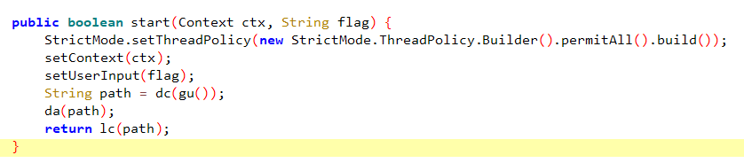
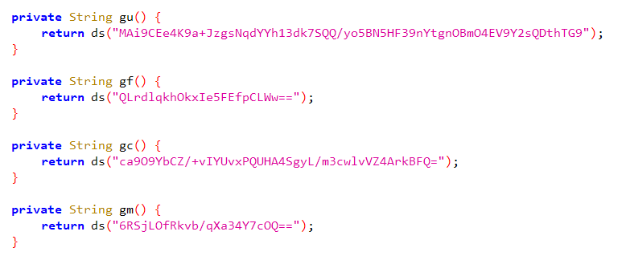
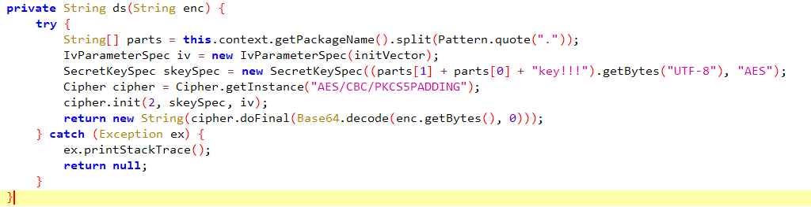
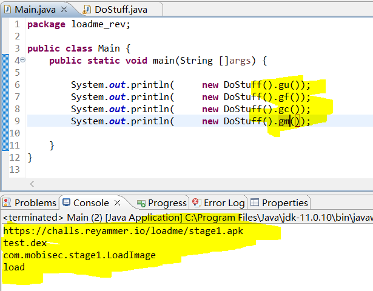
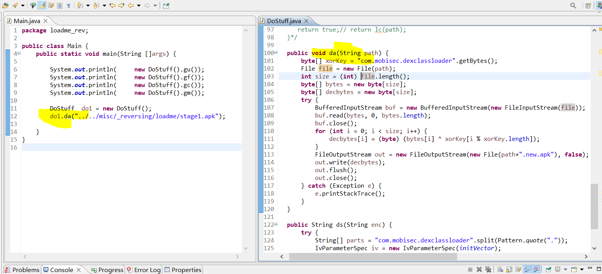
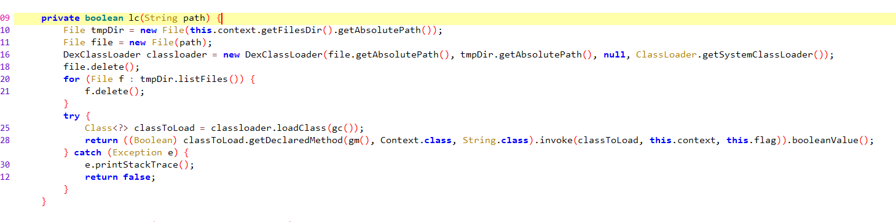
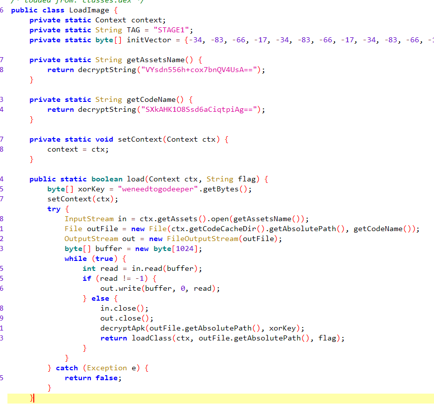
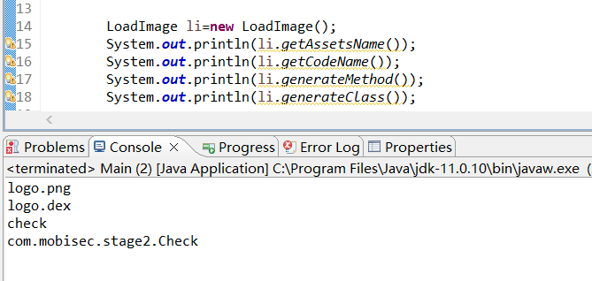
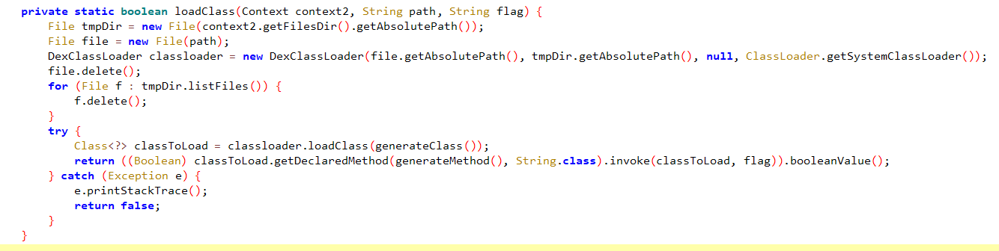
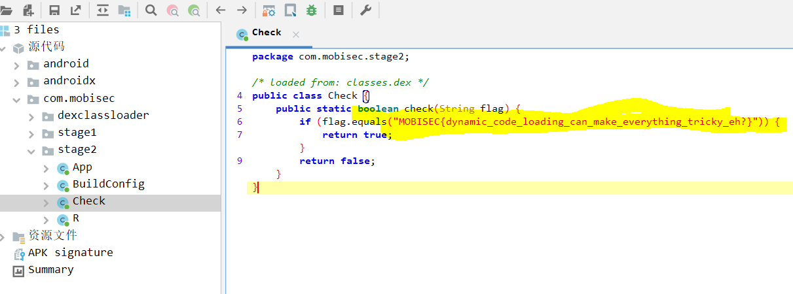

# Solution

## Description of the problem

reverse the apk and find the flag

## Solution

Let's see the codes.

### start(flag)

The function start(flag) will get the path via dc(gu()) first, then do da(path) and return lc(path). The function dc() is to download the file from url. So,  let's see what the function gu() is.

### gx(), ds(enc)

This will return the function ds(enc).

From the ds(enc) codes, we know that the function is decrypting the cipher to the plaintext. From the manifest file, `package="com.mobisec.dexclassloader"`, the key is `mobiseccomkey!!!`. Then we can decrypt the four gx() functions to the plaintext.

The plaintext gu() returns a url. It is a apk file. 

### da(path)

After downloading the apk file from url, it cannot be viewed directly, so the function da() is needed to decrypt it to the normal apk file. 

### lc(path)

Then, in the function lc(path), `DexClassLoader` is used to load class `com.mobisec.stage1.LoadImage` (function gc() returns the class name).

###  load(flag)

Then, let's see the function load(flag)

The assert name is `logo.png`, and the function load() will call the function decryptApk() to decrypt this file. 

### loadClass(path, flag)

After getting the decrypted file `logo.dex`, let's see the function loadClass(path, flag). 

It will load class `com.mobisec.stage2.Check` with the method/function check()

After reversing the codes of the file logo.dex, the function check(flag) gives us the flag.

### N/A

the codes refers to [_reversing/loadme/src/loadme_rev](_reversing/loadme/src/loadme_rev)

## Optional Feedback

## reference

DexClassLoader`: https://developer.android.com/reference/dalvik/system/DexClassLoader