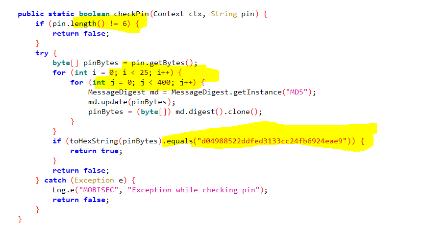

# Solution


## Description of the problem

reverse the .apk to get the pincode

## Solution

Firstly, I use jadx to get the source codes of the. apk package

The source codes include getFlag(pin) function:


From this function, I should send the pin to the url to get the flag.




Also, from this checkPin function, the length of PIN is 6, and after 10000 times of MD5, the hash value is "d04988522ddfed3133cc24fb6924eae9"


Therefore, I use the reversed java codes directly, to bruteforce the original pin.

```java
public class Main {
	public static void main(String []args) {
		for(int i=999999;i>=0;i--) {
			boolean r=PinChecker.checkPin(String.format("%06d", i));
			if(r==true) {
				 System.out.println(i);
				 break;
			}
		}
	}
}
```


Finally, I get the pin:


The codes refer to [_reversing\pincode\src\getpin_java](_reversing\pincode\src\getpin_java)

Then  I put the pin into the url, and I get the flag.


## Optional Feedback

I can curious what methods your website uses to prevent ddos. I try to use tor proxy to bruteforce https://challs.reyammer.io/pincode/ directly with changing IP addresses each time, but you website can always find out these get requests sent by me


## reference

