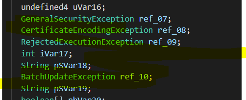

# Solution


## Description of the problem

reverse the apk and find the flag

## Solution

Let's see the codes.


From the reversed codes by jadx, the function checkFlag(string) is incomplete, and from the MainActivity class, it seems that the app will check if the user is using Frida no not. Therefore, let's try ghidra.


From the incomplete [reversed code](_reversing/upos/classes2.dex.IllformedLocaleException.java) of the function checkFlag() by ghidra, there are unreachable blocks that cannot be reversed, and at the end of the function there are exceptions. 


For now I don't find out methods to reverse the completed checkflag function code, so let's see the [smali code](_reversing/upos/FC_init.smali) first, and try to find something useful. For there is an exception `IllformedLocaleException` thrown out at the end, let's try to find this exception in smali code. 


In line 186, there is a new object`IllformedLocaleException` and store its reference to `v8`, and initialize it. Then there is a try/catch case to catch_248


In `catch_248`, the code will go to `goto_2b5`. Therefore, I try to remove this catch and throw by goto_2b5 directly from line 186.


Then, I use [JesusFreke](https://github.com/JesusFreke)/[smali](https://github.com/JesusFreke/smali) to assemble the [modified smali file](_reversing/upos/FC_modified.smali) into [dex](_reversing/upos/out1_IllformedLocaleException.dex), then use ghidra to reverse it again. Now there are some other information in the [reversed code](_reversing/upos/classes2.dex.otherthrow.java), and there are some other exceptions in the code.



I used the same method to modify the smali code to remove these exceptions, assemble the [modified smali file](_reversing/upos/FC_modified.smali) into [dex](_reversing/upos/out2_otherexceptions.dex), and then reverse to [java code](_reversing/upos/classes2.dex.checkflag_full.java).


Now let's see the checkFlag code. The code is pettifogging because most of lines at the beginning will mislead the reader to do meaningless operations. At least we know that the total length of flag is 69. Actually, for the reversed checkFlag function code gives the sha-2 value of the flag, I want to ignore the beginning part and only care about the cases after line 258 from the if case of `boolean[] pbVar19`. This boolean array is to record the result of different checks about the flag. The if case in line 258 checks `pbVar19[0]` and `pbVar19[1]`. From the above lines, these two positions are about if the flag starts with "MOBISEC{" and ends with "}". 


Also, from the if case in line283, there is a comparation of the value `lVar1` and the matrix `m`, and if the case is not true, the boolean array `pbVar19` will be false at the position of the while loop, so it seems that the values, stored in matrix `m` , which is got from the asset file "lotto.dat", will tell us what the flag is. Then, I just give a string with 60 characters to the flagCheck() and print out the corresponding matrix values. 


Here it gives 30 values. Next I need to find out what characters these values stand for. Obviously, one number is for two characters, so I brute-force two by two to find out the flag. Therefore, I modify the flagCheck() function to make it verify two characters according to the position parameter of the flag, and return 0 or the matrix `m` value if the two characters match the value. 


​		
```java
public class Main {
	public static void main(String []args) {
		StringBuilder  flag  = new StringBuilder("MOBISEC{************************************************************}");
		
		long[] values=new long[]{980441344,622452601,621355329,828461089,597411364,
			596531776,965531329,872493444,596434084,647804304,
			873320704,634183489,756745081,728352144,798514564,
			714706756,872907025,596727184,828921681,742235536,
			596727184,785232484,981380929,584430625,594774544,
			919908900,622053481,714172176,771117361,262148481};
		
		for(int i=0;i<30;i++) {
			boolean forfortag=false;
			for (char c1=32;c1<=126;c1++) {
				for (char c2=32;c2<=126;c2++)   {
					StringBuilder s=new StringBuilder();
					String temp=Character.toString(c1);
					s.append(temp);
					temp=Character.toString(c2);
					s.append(temp);
					
					flag.replace(2*i+8,2*i+10,s.toString());
					System.out.println(flag.toString());
					
		            if (FC.checkFlag1(flag.toString(),i) == values[i]) {
		            	System.out.println(s);
		            	forfortag=true;
		            	break;
		            }
				}
				if(forfortag==true) {
					forfortag=false;
					break;
				}
			}		
		}		
	}
}
```


After brute force, the flag is got. 


the brute force codes refers to [\_reversing/upos/\_upos/src/_upos ](_reversing/upos/\_upos/src/_upos), and assets refer to [\_reversing/upos](_reversing/upos).


## Optional Feedback

This challenge is toooooooooooooooooo difficult. I spent three days totally to solve it. 


## reference

smali/baksmali: https://github.com/JesusFreke/smali